# Container Diagram (Level 2) - Wrencos Platform

## Mermaid Diagram Code

```mermaid
graph TB
    subgraph Users["Users Layer"]
        Customer["Customer<br/>(Person)"]
        Admin["Admin/Seller<br/>(Person)"]
        Guest["Guest<br/>(Person)"]
    end

    subgraph WebTier["Web Tier"]
        WebApp["Web Application<br/>(Vue.js 3 SPA)<br/>Product Browsing<br/>Shopping Cart<br/>Order Management<br/>Analytics Dashboard<br/>Admin Panel"]
    end

    subgraph MobileTier["Mobile Tier"]
        CustomerApp["Customer Mobile App<br/>(React Native + Expo)<br/>Product Browsing<br/>Livestream Viewing<br/>AI Consultation<br/>Order Tracking<br/>Live Chat"]
        AdminApp["Admin Mobile App<br/>(React Native + Expo)<br/>Livestream Hosting<br/>Product Management<br/>Order Management<br/>Analytics"]
    end

    subgraph APITier["Backend API Server - Node.js + Express - Port 3000"]
        AppCore["Express.js Core<br/>CORS Enabled<br/>Rate Limiting<br/>Swagger Docs<br/>Static File Serving"]
        
        subgraph AuthModule["Auth Module"]
            AuthRoutes["Auth Routes /auth<br/>Login, Register<br/>Token Refresh"]
            UserRoutes["User Routes /users<br/>Profile Management"]
        end
        
        subgraph EcommerceModule["E-Commerce Module"]
            ProductRoutes["Product Routes /products<br/>Browse, Search, Filter"]
            CategoryRoutes["Category Routes /categories<br/>List Categories"]
            OrderRoutes["Order Routes /orders<br/>Create, History, Status"]
            PaymentRoutes["Payment Routes /payments<br/>Process, Status"]
        end
        
        subgraph CommunicationModule["Communication Module"]
            ChatRoutes["Chat Routes /chat<br/>Customer Support<br/>Chat History"]
        end
        
        subgraph LivestreamModule["Livestream Module"]
            LivestreamRoutes["Livestream Routes /livestreams<br/>Create Stream<br/>Stream Status<br/>Viewer Count"]
        end
        
        subgraph MarketingModule["Marketing Module"]
            NewsletterRoutes["Newsletter Routes /newsletter<br/>Subscribe, Unsubscribe"]
            EmailCampaignRoutes["Email Campaign Routes<br/>/email-campaigns"]
            EmailTemplateRoutes["Email Template Routes<br/>/email-templates"]
            EmailSegmentRoutes["Email Segment Routes<br/>/email-segments"]
        end
        
        subgraph FinanceModule["Finance Module"]
            CashFlowRoutes["Cash Flow Routes /cashflow<br/>Track Transactions"]
        end
        
        subgraph HRModule["HR Module"]
            HRRoutes["HR Routes /hr<br/>Employee Management"]
        end
        
        subgraph AnalyticsModule["Analytics Module"]
            AnalyticsRoutes["Analytics Routes /analytics<br/>Business Metrics<br/>User Behavior"]
        end
        
        subgraph AIModule["AI Module"]
            AIRoutes["AI Dermatology Routes<br/>/api/ai-dermatology-expert<br/>Skin Consultation<br/>Recommendations"]
        end
        
        subgraph UploadModule["Upload Module"]
            UploadRoutes["Upload Routes /uploads<br/>File Upload, Management"]
        end
        
        subgraph Services["Services Layer"]
            EmailService["Email Service<br/>Send Emails<br/>Email Campaigns"]
            GeminiService["Gemini AI Service<br/>AI Consultation<br/>Recommendations"]
            VectorService["Vector Service<br/>Semantic Search<br/>RAG Support"]
            TTSService["TTS Service<br/>Text-to-Speech<br/>Audio Generation"]
        end
        
        subgraph Middleware["Middleware Layer"]
            AuthMiddleware["Auth Middleware<br/>JWT Verification"]
            RoleMiddleware["Role Middleware<br/>RBAC Permission Check"]
            RateLimiter["Rate Limiter<br/>Request Throttling"]
        end
        
        subgraph WebSocketServer["WebSocket Manager - ws Library"]
            WSCore["WebSocket Core<br/>Connection Management<br/>Message Routing"]
            CustomerWS["Customer Connections<br/>Session Tracking"]
            AdminWS["Admin Connections<br/>User ID Tracking"]
            WSFeatures["WebSocket Features<br/>Live Chat<br/>Stream Status<br/>Likes, Engagement<br/>Viewer Count<br/>WebRTC Signaling"]
        end
    end

    subgraph DataTier["Data Tier"]
        MongoDB["MongoDB Atlas<br/>(Cloud Database)<br/>Users, Products<br/>Orders, Payments<br/>Chat Conversations<br/>Livestreams<br/>Email Data<br/>Employee Records<br/>Financial Data<br/>Dermatology KB"]
        
        Qdrant["Qdrant<br/>(Vector Database)<br/>Product Embeddings<br/>Knowledge Base<br/>Semantic Search<br/>RAG Support"]
    end

    subgraph ExternalServices["External Services"]
        GeminiAPI["Google Gemini API<br/>(External AI)<br/>Dermatology Consultation<br/>Product Recommendations"]
        
        VNPay["VNPay Gateway<br/>(Payment Processor)<br/>Payment Processing<br/>Transaction Handling"]
        
        SMTP["SMTP Email Server<br/>(Email Service)<br/>Transactional Emails<br/>Marketing Campaigns"]
        
        Agora["Agora SDK<br/>(Video Streaming)<br/>Live Video<br/>Real-time Communication"]
    end

    %% User Connections
    Customer -->|Uses| WebApp
    Customer -->|Uses| CustomerApp
    Admin -->|Uses| AdminApp
    Admin -->|Uses| WebApp
    Guest -->|Uses| WebApp
    Guest -->|Uses| CustomerApp

    %% Web App to Backend
    WebApp -->|REST API| AppCore
    WebApp -->|WebSocket| WSCore

    %% Mobile Apps to Backend
    CustomerApp -->|REST API| AppCore
    CustomerApp -->|WebSocket| WSCore
    CustomerApp -->|Video| Agora
    
    AdminApp -->|REST API| AppCore
    AdminApp -->|WebSocket| WSCore
    AdminApp -->|Video| Agora

    %% Backend Routes to Services
    AuthRoutes -->|Uses| AuthMiddleware
    AuthRoutes -->|Uses| RateLimiter
    
    EcommerceModule -->|Uses| RoleMiddleware
    EcommerceModule -->|Uses| RateLimiter
    
    CommunicationModule -->|Uses| AuthMiddleware
    
    LivestreamModule -->|Uses| AuthMiddleware
    
    MarketingModule -->|Uses| EmailService
    
    AIModule -->|Uses| GeminiService
    AIModule -->|Uses| VectorService
    
    UploadModule -->|Uses| RateLimiter

    %% Services to External APIs
    EmailService -->|SMTP| SMTP
    GeminiService -->|HTTP API| GeminiAPI
    VectorService -->|HTTP API| Qdrant
    TTSService -->|Uses| GeminiAPI

    %% Payment Processing
    PaymentRoutes -->|Payment Request| VNPay
    VNPay -->|Payment Status| PaymentRoutes

    %% WebSocket Features
    WSCore -->|Manages| CustomerWS
    WSCore -->|Manages| AdminWS
    CustomerWS -->|Broadcasts| WSFeatures
    AdminWS -->|Controls| WSFeatures

    %% Backend to Databases
    AppCore -->|Query/Update| MongoDB
    AuthRoutes -->|User Data| MongoDB
    EcommerceModule -->|Product Data| MongoDB
    CommunicationModule -->|Chat Data| MongoDB
    LivestreamModule -->|Stream Data| MongoDB
    MarketingModule -->|Campaign Data| MongoDB
    FinanceModule -->|Transaction Data| MongoDB
    HRModule -->|Employee Data| MongoDB
    AnalyticsModule -->|Analytics Data| MongoDB
    AIModule -->|KB Data| MongoDB
    
    VectorService -->|Vector Data| Qdrant
    GeminiService -->|Retrieve Context| Qdrant

    %% WebSocket to Database
    WSCore -->|Update State| MongoDB
    WSCore -->|Store Messages| MongoDB

    %% Styling
    classDef userClass fill:#08427b,stroke:#05294a,color:#fff
    classDef webClass fill:#1168bd,stroke:#0d3f7f,color:#fff
    classDef mobileClass fill:#1168bd,stroke:#0d3f7f,color:#fff
    classDef apiClass fill:#438dd5,stroke:#2d5a8f,color:#fff
    classDef moduleClass fill:#85b3d1,stroke:#5a7a99,color:#000
    classDef serviceClass fill:#b3d9e8,stroke:#7a9fb5,color:#000
    classDef middlewareClass fill:#d4e6f1,stroke:#9ab5c7,color:#000
    classDef wsClass fill:#f39c12,stroke:#c87f0a,color:#000
    classDef dataClass fill:#27ae60,stroke:#1e8449,color:#fff
    classDef externalClass fill:#e74c3c,stroke:#c0392b,color:#fff

    class Customer,Admin,Guest userClass
    class WebApp webClass
    class CustomerApp,AdminApp mobileClass
    class AppCore apiClass
    class AuthModule,EcommerceModule,CommunicationModule,LivestreamModule,MarketingModule,FinanceModule,HRModule,AnalyticsModule,AIModule,UploadModule moduleClass
    class EmailService,GeminiService,VectorService,TTSService serviceClass
    class AuthMiddleware,RoleMiddleware,RateLimiter middlewareClass
    class WebSocketServer,WSCore,CustomerWS,AdminWS,WSFeatures wsClass
    class MongoDB,Qdrant dataClass
    class GeminiAPI,VNPay,SMTP,Agora externalClass
```

---

## Diagram Description

### **Layers:**

1. **Users Layer**
   - Customer, Admin/Seller, Guest users

2. **Web Tier**
   - Vue.js 3 Single Page Application
   - Communicates via REST API and WebSocket

3. **Mobile Tier**
   - Customer Mobile App (React Native + Expo)
   - Admin Mobile App (React Native + Expo)
   - Both support livestreaming and real-time features

4. **Backend API Server (Node.js + Express)**
   - **Core:** Express.js with CORS, rate limiting, Swagger docs
   - **10 Modular Route Modules:** Auth, E-Commerce, Communication, Livestream, Marketing, Finance, HR, Analytics, AI, Uploads
   - **Services:** Email, Gemini AI, Vector Search, Text-to-Speech
   - **Middleware:** Authentication, RBAC, Rate Limiting
   - **WebSocket Manager:** Real-time communication, chat, stream status, engagement tracking

5. **Data Tier**
   - MongoDB Atlas (primary database)
   - Qdrant (vector database for semantic search)

6. **External Services**
   - Google Gemini API (AI consultation)
   - VNPay (payment processing)
   - SMTP (email service)
   - Agora SDK (video streaming)

### **Key Features:**

- **REST API Communication:** All frontend/mobile apps communicate with backend via HTTP/HTTPS
- **Real-time WebSocket:** Live chat, stream status, viewer count, likes
- **Modular Architecture:** Separated concerns with dedicated route modules
- **Service-Oriented:** Reusable services for common functionality
- **Security:** JWT authentication, RBAC, rate limiting
- **Scalability:** Cloud database, vector search, microservices pattern
- **AI Integration:** Gemini AI for intelligent features
- **Payment Processing:** VNPay integration for transactions
- **Video Streaming:** Agora SDK for live shopping events
- **Email Marketing:** Comprehensive email campaign management

---

## Color Coding:

- **Dark Blue:** Users and Web/Mobile Applications
- **Light Blue:** Backend API and Modules
- **Yellow/Orange:** WebSocket Real-time Communication
- **Green:** Databases
- **Red:** External Services

---

## How to Use This Diagram:

1. **Copy the Mermaid code** above
2. **Paste it into:**
   - GitHub README (renders automatically)
   - GitLab (renders automatically)
   - Notion (use Mermaid block)
   - Mermaid Live Editor: https://mermaid.live
   - Any Markdown editor with Mermaid support

3. **The diagram shows:**
   - All system containers and their relationships
   - Data flow between components
   - External system integrations
   - Technology stack for each container
   - Communication protocols (REST API, WebSocket)

