# Container Diagram (Level 2) - Wrencos Platform

## Mermaid Diagram

```mermaid
graph TB
    subgraph "User Interfaces"
        WEB["🌐 Web Application<br/>Vue.js 3 + Vite<br/>Tailwind CSS"]
        MOBILE["📱 Mobile App<br/>React Native + Expo"]
    end

    subgraph "Backend Services"
        API["🔧 Backend API Server<br/>Node.js + Express.js<br/>Port: 3000"]
        WS["🔌 WebSocket Manager<br/>Real-time Communication<br/>Customer Support Chat"]
    end

    subgraph "Data & Storage"
        MONGO["🗄️ MongoDB Atlas<br/>Cloud Database<br/>Users, Products, Orders,<br/>Chats, Analytics"]
        VECTOR["🔍 Qdrant Vector DB<br/>Semantic Search<br/>Knowledge Base<br/>Embeddings"]
    end

    subgraph "External Services"
        GEMINI["🤖 Google Gemini AI<br/>Dermatology Consultation<br/>Product Recommendations<br/>AI Chat"]
        VNPAY["💳 VNPay Gateway<br/>Payment Processing<br/>Transaction Handling"]
        SMTP["📧 SMTP Email Server<br/>Transactional Emails<br/>Marketing Campaigns<br/>Newsletters"]
    end

    %% Web Application Connections
    WEB -->|REST API| API
    WEB -->|WebSocket| WS

    %% Mobile Customer Connections
    MOBILE -->|REST API| API
    MOBILE -->|WebSocket| WS

    %% Backend to Data Storage
    API -->|Read/Write| MONGO
    API -->|Query| VECTOR
    WS -->|Read/Write| MONGO

    %% Backend to External Services
    API -->|AI Queries| GEMINI
    API -->|Process Payments| VNPAY
    API -->|Send Emails| SMTP

    %% Styling
    classDef ui fill:#4A90E2,stroke:#2E5C8A,stroke-width:2px,color:#fff
    classDef backend fill:#7B68EE,stroke:#5A4BA8,stroke-width:2px,color:#fff
    classDef storage fill:#50C878,stroke:#2D7A4A,stroke-width:2px,color:#fff
    classDef external fill:#FF6B6B,stroke:#CC5555,stroke-width:2px,color:#fff

    class WEB,MOBILE ui
    class API,WS backend
    class MONGO,VECTOR storage
    class GEMINI,VNPAY,SMTP external
```



> **Note:** For detailed livestream architecture, see [LIVESTREAM_CONTAINER_DIAGRAM.md](./LIVESTREAM_CONTAINER_DIAGRAM.md) which contains separate diagrams for Web (Native WebRTC) and Mobile (Agora SDK) livestream implementations.

## Container Descriptions

### **User Interfaces**
| Container | Technology | Purpose |
|-----------|-----------|---------|
| **Web Application** | Vue.js 3, Vite, Tailwind CSS | Web-based shopping, admin dashboard, analytics |
| **Mobile App - Customer** | React Native, Expo | Mobile shopping, AI consultation, customer support |
| **Mobile App - Admin** | React Native, Expo | Product management, customer support, admin operations |

### **Backend Services**
| Container | Technology | Purpose |
|-----------|-----------|---------|
| **Backend API Server** | Node.js, Express.js | RESTful API endpoints, business logic, route handlers |
| **WebSocket Manager** | ws library | Real-time customer support chat |

### **Data & Storage**
| Container | Technology | Purpose |
|-----------|-----------|---------|
| **MongoDB Atlas** | MongoDB Cloud | Persistent data storage (users, products, orders, chats, analytics) |
| **Qdrant Vector DB** | Vector Database | Semantic search, knowledge base embeddings, RAG |

### **External Services**
| Container | Service | Purpose |
|-----------|---------|---------|
| **Google Gemini AI** | Google API | AI dermatology consultation, recommendations, chat |
| **VNPay Gateway** | Payment Service | Payment processing, transaction handling |
| **SMTP Email Server** | Email Service | Transactional emails, marketing campaigns, newsletters |

## Data Flow Summary

### **REST API Communication**
```
Frontend/Mobile → HTTP/HTTPS → Backend API → Controllers → MongoDB
```

### **Real-Time Communication**
```
Frontend/Mobile ← WebSocket → WebSocket Manager → MongoDB
```

### **AI Processing**
```
User Query → Backend API → Gemini AI → Response
```

### **Payment Processing**
```
Frontend → Backend API → VNPay → Payment Status → MongoDB
```

### **Email Distribution**
```
Backend Service → SMTP Server → User Email
```

## Key Interactions

1. **Web & Mobile Apps** communicate with Backend API via REST and WebSocket
2. **Backend API** manages all business logic and routes requests
3. **WebSocket Manager** handles real-time updates for customer support chat
4. **MongoDB** stores all persistent data
5. **Qdrant** provides semantic search capabilities
6. **External Services** handle specialized functions (AI, payments, email)

> **Livestream Feature:** For detailed livestream architecture including video streaming, WebSocket events, and real-time engagement, see [LIVESTREAM_CONTAINER_DIAGRAM.md](./LIVESTREAM_CONTAINER_DIAGRAM.md)

## Technology Stack

- **Frontend:** Vue.js 3, Vite, Tailwind CSS
- **Mobile:** React Native, Expo
- **Backend:** Node.js, Express.js
- **Database:** MongoDB Atlas
- **Vector DB:** Qdrant
- **Real-time:** WebSocket
- **AI:** Google Gemini API
- **Payment:** VNPay
- **Email:** SMTP/Nodemailer

