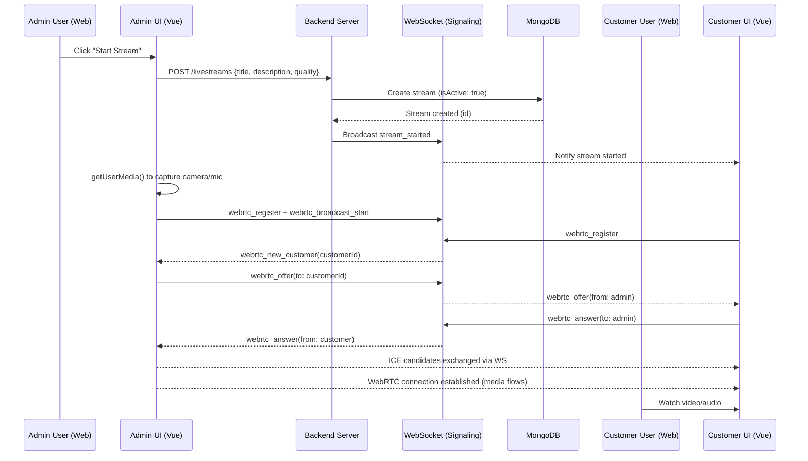
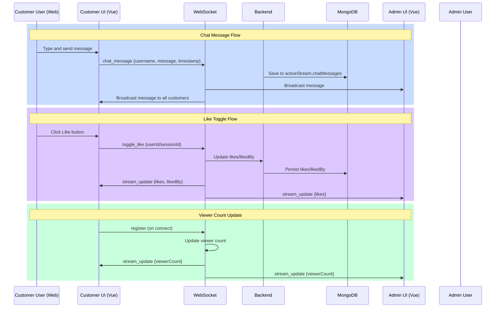
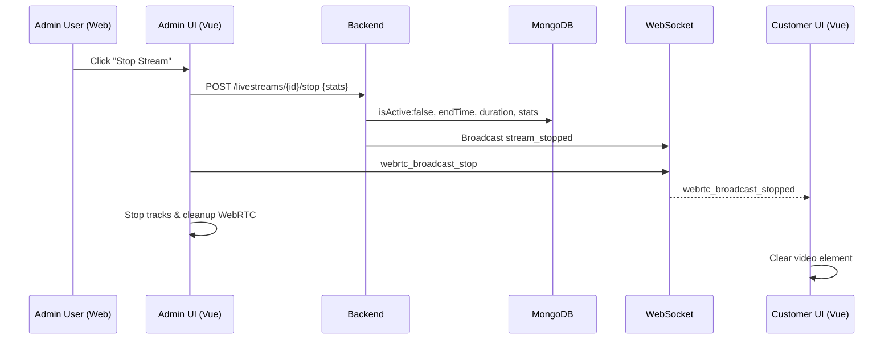
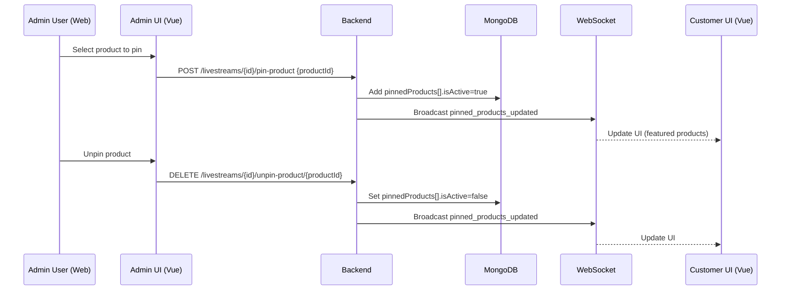
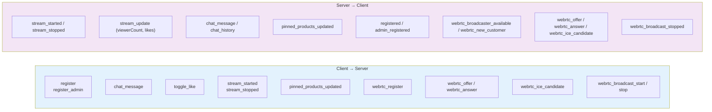
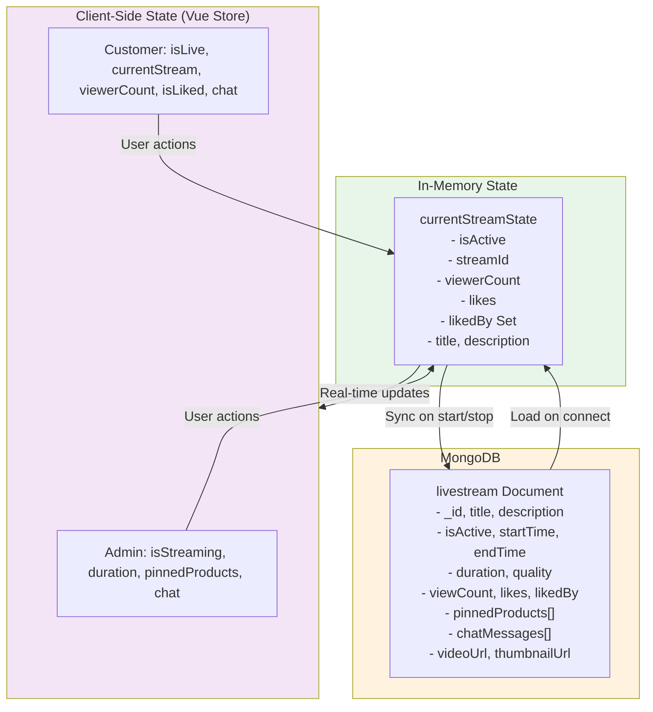
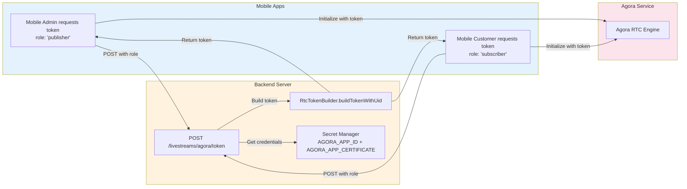

# Livestream Architecture Diagram (Web uses WebRTC; Mobile uses Agora)

## System Overview Diagram

```mermaid
graph TB
    subgraph AdminWeb["🖥️ Admin Web Interface"]
        AdminUI["Admin Live Stream Page<br/>AdminLiveStream.vue"]
        AdminControls["Stream Controls<br/>- Start/Stop<br/>- Camera Toggle<br/>- Mic Toggle<br/>- Pin Products"]
        AdminChat["Admin Chat<br/>Send/Receive Messages"]
    end

    subgraph CustomerWeb["👥 Customer Web Interface"]
        CustomerUI["Customer Live Stream Page<br/>LiveStream.vue"]
        VideoPlayer["Video Player<br/>Plays WebRTC Remote Media"]
        CustomerChat["Customer Chat<br/>Send Messages"]
        LikeButton["Like Button<br/>Toggle Like"]
    end

    subgraph Backend["⚙️ Backend Server"]
        Controller["Live Stream Controller<br/>liveStreamController.js"]
        Model["Live Stream Model<br/>liveStream.js"]
        Database["MongoDB<br/>Streams, Chat, Stats"]
        WebSocketMgr["WebSocket Manager<br/>websocket.js"]
        SecretMgr["Secret Manager<br/>secretManager.js"]
    end

    subgraph RealTime["🔄 Real-Time Communication"]
        WebSocket["WebSocket Server<br/>Signaling + Live updates"]
    end

    %% Web (Browser) Streaming via WebRTC
    subgraph WebStreaming["📹 Web Streaming (Browser)"]
        WebRTC["WebRTC (RTCPeerConnection)<br/>Peer-to-peer Media"]
        Signaling["Signaling via WebSocket<br/>webrtc_* messages"]
    end

    %% Mobile Streaming via Agora (Separate from Web)
    subgraph MobileStreaming["📱 Mobile Streaming (Agora)"]
        AgoraSDK["Agora SDK (Mobile Apps)"]
        AgoraToken["Token Endpoint<br/>/livestreams/agora/token"]
    end

    subgraph Storage["💾 Storage"]
        VideoFiles["Video Files<br/>uploads/livestreams/"]
        Thumbnails["Thumbnails<br/>uploads/thumbnails/"]
    end

    %% Admin Web Connections (WebRTC)
    AdminUI --> AdminControls
    AdminUI --> AdminChat
    AdminControls -->|Create/Stop Stream (REST)| Controller
    AdminChat -->|Send Message| WebSocketMgr

    %% Customer Web Connections (WebRTC)
    CustomerUI --> VideoPlayer
    CustomerUI --> CustomerChat
    CustomerUI --> LikeButton
    CustomerChat -->|Send Message| WebSocketMgr
    LikeButton -->|Toggle Like| WebSocketMgr

    %% WebRTC Signaling
    AdminUI -->|webrtc_register / broadcast_start| WebSocketMgr
    CustomerUI -->|webrtc_register| WebSocketMgr
    WebSocketMgr -->|offer/answer/ICE relay| AdminUI
    WebSocketMgr -->|offer/answer/ICE relay| CustomerUI

    %% Media Path (Web)
    AdminUI -->|Send Media Tracks| WebRTC
    WebRTC -->|Remote Media| VideoPlayer

    %% Backend Connections
    Controller -->|Save/Update| Model
    Model -->|Persist Data| Database
    Controller -->|Broadcast status| WebSocketMgr
    WebSocketMgr -->|Manage Connections| WebSocket

    %% Storage
    Controller -->|Save Video| VideoFiles
    Controller -->|Save Thumbnail| Thumbnails

    %% Mobile (Agora) - separate path from Web
    AgoraToken -->|Get credentials| SecretMgr
    AgoraSDK -->|Used by Mobile Apps| AgoraToken

    style AdminWeb fill:#e1f5ff
    style CustomerWeb fill:#f3e5f5
    style Backend fill:#fff3e0
    style RealTime fill:#e8f5e9
    style WebStreaming fill:#e8f4ff
    style MobileStreaming fill:#fce4ec
    style Storage fill:#f1f8e9
```

## Detailed Flow (Web): Admin Starts Livestream with WebRTC



## Detailed Flow (Web): Customer Interactions During Livestream



## Detailed Flow (Web): Admin Stops Livestream



## Detailed Flow: Pinned Products (Web)



## WebSocket Message Types (Web + Signaling)



## Data Flow: Stream State Management (Web)



## Mobile-only: Agora Token Generation (Not used by Web)



## Key Components Summary

- Web (Browser):
  - frontend/src/pages/admin/live-stream/AdminLiveStream.vue (captures camera/mic, starts/stops stream, pins products)
  - frontend/src/pages/customer/live-stream/LiveStream.vue (plays WebRTC remote stream, likes, chat)
  - frontend/src/stores/livestreamStore.js (WebSocket + WebRTC signaling, peer management)
  - backend/websocket.js (signaling server, chat/likes/viewers, pinned products)
  - backend/controllers/livestream/liveStreamController.js (REST CRUD, recording upload, pinned products)
- Mobile (Agora):
  - mobile-app-admin and mobile-app-customer use Agora SDK; backend exposes /livestreams/agora/token
