# Livestream Container Diagram (Level 2)

## Mermaid Diagram

```mermaid
graph TB
    subgraph "Web Interfaces"
        WEB_ADMIN["🖥️ Web Admin Dashboard<br/>Vue.js 3<br/>Manage Livestreams<br/>View Analytics"]
        WEB_CUST["🖥️ Web Customer Portal<br/>Vue.js 3<br/>Watch Livestreams<br/>Chat & Engage"]
    end

    subgraph "Mobile Interfaces"
        MOBILE_ADMIN["📱 Mobile Admin App<br/>React Native<br/>Start/Stop Streams<br/>Broadcast Video"]
        MOBILE_CUST["📱 Mobile Customer App<br/>React Native<br/>Watch Streams<br/>Chat & Like"]
    end

    subgraph "Backend Services"
        API["🔧 Backend API Server<br/>Node.js + Express<br/>Livestream Routes<br/>Business Logic"]
        WS["🔌 WebSocket Manager<br/>Real-time Events<br/>Chat Messages<br/>Likes & Viewer Count<br/>Stream Status"]
    end

    subgraph "Data Storage"
        MONGO["🗄️ MongoDB Atlas<br/>LiveStream Collection<br/>- Stream Metadata<br/>- Chat Messages<br/>- Viewer Data<br/>- Likes & Engagement"]
    end

    subgraph "Video Service"
        AGORA["🎥 Agora SDK<br/>Live Video Streaming<br/>Video Broadcast<br/>Video Playback"]
    end

    %% Web Admin Connections
    WEB_ADMIN -->|REST API| API
    WEB_ADMIN -->|WebSocket| WS
    WEB_ADMIN -->|View Stream| AGORA

    %% Web Customer Connections
    WEB_CUST -->|REST API| API
    WEB_CUST -->|WebSocket| WS
    WEB_CUST -->|Watch Stream| AGORA

    %% Mobile Admin Connections
    MOBILE_ADMIN -->|REST API| API
    MOBILE_ADMIN -->|WebSocket| WS
    MOBILE_ADMIN -->|Broadcast Video| AGORA

    %% Mobile Customer Connections
    MOBILE_CUST -->|REST API| API
    MOBILE_CUST -->|WebSocket| WS
    MOBILE_CUST -->|Watch Stream| AGORA

    %% Backend to Data Storage
    API -->|Create/Update/Read| MONGO
    WS -->|Save Chat<br/>Update Likes<br/>Viewer Count| MONGO

    %% Backend to Video Service
    API -->|Generate Token<br/>Configure Stream| AGORA

    %% Styling
    classDef web fill:#4A90E2,stroke:#2E5C8A,stroke-width:2px,color:#fff
    classDef mobile fill:#5DADE2,stroke:#2E5C8A,stroke-width:2px,color:#fff
    classDef backend fill:#7B68EE,stroke:#5A4BA8,stroke-width:2px,color:#fff
    classDef storage fill:#50C878,stroke:#2D7A4A,stroke-width:2px,color:#fff
    classDef video fill:#FF6B6B,stroke:#CC5555,stroke-width:2px,color:#fff

    class WEB_ADMIN,WEB_CUST web
    class MOBILE_ADMIN,MOBILE_CUST mobile
    class API,WS backend
    class MONGO storage
    class AGORA video
```



## Container Details

### **Web Interfaces**

#### **Web Admin Dashboard**
- **Technology:** Vue.js 3, Vite, Tailwind CSS
- **Features:**
  - Create/schedule livestreams
  - Start and stop streams
  - View real-time analytics
  - Monitor viewer count
  - Manage chat moderation
  - View engagement metrics (likes, comments)
  - Product pinning during stream

#### **Web Customer Portal**
- **Technology:** Vue.js 3, Vite, Tailwind CSS
- **Features:**
  - Browse active livestreams
  - Watch streams in real-time
  - Participate in chat
  - Like/engage with stream
  - View pinned products
  - Purchase products during stream
  - View stream history

### **Mobile Interfaces**

#### **Mobile Admin App**
- **Technology:** React Native, Expo
- **Features:**
  - Start livestream broadcast
  - Stop livestream
  - Real-time video streaming
  - View live chat
  - Monitor viewer count
  - Manage pinned products
  - View engagement metrics

#### **Mobile Customer App**
- **Technology:** React Native, Expo
- **Features:**
  - Watch livestreams
  - Real-time video playback
  - Send chat messages
  - Like/engage with stream
  - View pinned products
  - Quick purchase during stream
  - View stream recommendations

### **Backend Services**

#### **Backend API Server**
- **Technology:** Node.js, Express.js
- **Routes:** `/livestreams`
- **Key Endpoints:**
  - `POST /livestreams` - Create livestream
  - `GET /livestreams` - Get active streams
  - `GET /livestreams/:id` - Get stream details
  - `PUT /livestreams/:id` - Update stream
  - `DELETE /livestreams/:id` - End stream
  - `POST /livestreams/:id/products` - Pin products
  - `GET /livestreams/:id/chat` - Get chat history

#### **WebSocket Manager**
- **Technology:** ws library
- **Real-time Events:**
  - `stream_started` - Broadcast stream start
  - `stream_stopped` - Broadcast stream end
  - `chat_message` - Send/receive chat
  - `toggle_like` - Like/unlike stream
  - `stream_update` - Viewer count, likes update
  - `pinned_products_updated` - Product changes
  - `chat_history` - Send chat history to new viewers

### **Data Storage**

#### **MongoDB Atlas - LiveStream Collection**
```javascript
{
  _id: ObjectId,
  title: String,
  description: String,
  createdBy: ObjectId (User reference),
  startTime: Date,
  endTime: Date,
  duration: Number,
  isActive: Boolean,
  
  // Video & Streaming
  streamUrl: String,
  quality: String (720p, 1080p),
  
  // Engagement
  viewerCount: Number,
  likes: Number,
  likedBy: [ObjectId],
  
  // Chat & Communication
  chatMessages: [
    {
      username: String,
      message: String,
      timestamp: Date,
      isAdmin: Boolean
    }
  ],
  
  // Products
  pinnedProducts: [ObjectId],
  
  // Analytics
  totalViewers: Number,
  peakViewers: Number,
  engagementRate: Number,
  
  createdAt: Date,
  updatedAt: Date
}
```

### **Video Service**

#### **Agora SDK**
- **Technology:** Agora Real-time Communication
- **Features:**
  - Live video broadcasting
  - Real-time video playback
  - Multi-user video sessions
  - Token-based authentication
  - Quality adaptation
  - Low-latency streaming

## Data Flow Diagrams

### **Stream Start Flow**
```
Mobile Admin → REST API → Backend → MongoDB (Create record)
                ↓
           Generate Agora Token
                ↓
           WebSocket → Broadcast "stream_started"
                ↓
        Web/Mobile Customers receive notification
```

### **Real-time Chat Flow**
```
Customer sends message → WebSocket → Backend
                              ↓
                        Save to MongoDB
                              ↓
                    Broadcast to all viewers
```

### **Like/Engagement Flow**
```
Customer clicks Like → WebSocket → Backend
                            ↓
                    Update in-memory state
                            ↓
                    Save to MongoDB
                            ↓
                    Broadcast to all viewers
```

### **Stream End Flow**
```
Mobile Admin → REST API → Backend → Update MongoDB (isActive = false)
                ↓
           WebSocket → Broadcast "stream_stopped"
                ↓
        Web/Mobile Customers receive notification
```

### **New Viewer Joins Flow**
```
Customer connects → WebSocket → Backend
                        ↓
                  Increment viewer count
                        ↓
                  Send current stream state
                        ↓
                  Send chat history
                        ↓
                  Broadcast updated viewer count
```

## Key Interactions

### **1. Web Admin to Backend**
- REST API: Create, update, manage livestreams
- WebSocket: Real-time stream status and analytics
- Agora: View stream preview

### **2. Web Customer to Backend**
- REST API: Get active streams, stream details
- WebSocket: Receive chat, likes, viewer updates
- Agora: Watch livestream

### **3. Mobile Admin to Backend**
- REST API: Start/stop stream, manage products
- WebSocket: Broadcast stream events
- Agora: Broadcast video

### **4. Mobile Customer to Backend**
- REST API: Get stream list, stream details
- WebSocket: Send/receive chat, like stream
- Agora: Watch livestream

### **5. Backend to MongoDB**
- Create livestream records
- Save chat messages
- Update viewer count
- Track likes and engagement
- Store stream analytics

### **6. Backend to Agora**
- Generate access tokens
- Configure stream settings
- Manage video quality
- Handle stream lifecycle

## Data Saved in MongoDB

| Data Type | Collection | Details |
|-----------|-----------|---------|
| **Stream Metadata** | livestreams | Title, description, creator, timing |
| **Stream Status** | livestreams | Active status, start/end times |
| **Chat Messages** | livestreams.chatMessages | User messages, timestamps, admin flag |
| **Engagement** | livestreams | Likes count, liked by users |
| **Viewers** | livestreams | Total viewers, peak viewers |
| **Products** | livestreams.pinnedProducts | Pinned product IDs |
| **Analytics** | livestreams | Engagement rate, viewer metrics |

## Technology Stack

| Component | Technology |
|-----------|-----------|
| **Web Admin** | Vue.js 3, Vite, Tailwind CSS |
| **Web Customer** | Vue.js 3, Vite, Tailwind CSS |
| **Mobile Admin** | React Native, Expo |
| **Mobile Customer** | React Native, Expo |
| **Backend API** | Node.js, Express.js |
| **Real-time** | WebSocket (ws) |
| **Database** | MongoDB Atlas |
| **Video** | Agora SDK |

## API Endpoints Summary

```
POST   /livestreams              - Create new livestream
GET    /livestreams              - Get all active livestreams
GET    /livestreams/:id          - Get specific livestream details
PUT    /livestreams/:id          - Update livestream
DELETE /livestreams/:id          - End livestream
GET    /livestreams/:id/chat     - Get chat history
POST   /livestreams/:id/products - Pin products
GET    /livestreams/:id/analytics - Get stream analytics
```

## WebSocket Events

```
Client → Server:
  - register                    - Register customer connection
  - register_admin              - Register admin connection
  - chat_message                - Send chat message
  - toggle_like                 - Like/unlike stream
  - start_stream                - Start livestream
  - stop_stream                 - Stop livestream
  - pinned_products_updated     - Update pinned products

Server → Client:
  - stream_started              - Notify stream started
  - stream_stopped              - Notify stream ended
  - chat_message                - Broadcast chat
  - stream_update               - Update viewer count, likes
  - chat_history                - Send chat history
  - pinned_products_updated     - Notify product changes
```

## Summary

This Container Diagram shows how the **Livestream feature** is distributed across:
- **4 User Interfaces** (Web Admin, Web Customer, Mobile Admin, Mobile Customer)
- **2 Backend Services** (API Server, WebSocket Manager)
- **1 Database** (MongoDB for all livestream data)
- **1 Video Service** (Agora for streaming)

All real-time events flow through **WebSocket**, while persistent data is stored in **MongoDB**, and video streaming is handled by **Agora SDK**.

