# Livestream Container Diagrams (Level 2)

## Web Livestream Container Diagram

```mermaid
graph TB
    subgraph "Web Interfaces"
        WEB_ADMIN["🖥️ Web Admin Dashboard<br/>Vue.js 3 + Vite<br/>Manage Livestreams<br/>View Analytics<br/>WebRTC Broadcast"]
        WEB_CUST["🖥️ Web Customer Portal<br/>Vue.js 3 + Vite<br/>Watch Livestreams<br/>Chat & Engage<br/>WebRTC Viewer"]
    end

    subgraph "Backend Services"
        API["🔧 Backend API Server<br/>Node.js + Express<br/>/livestreams Routes<br/>LiveStream Controller"]
        WS["🔌 WebSocket Manager<br/>websocket.js<br/>Real-time Events<br/>Chat Messages<br/>Stream Status<br/>Viewer Count & Likes"]
    end

    subgraph "Data Storage"
        MONGO["🗄️ MongoDB Atlas<br/>LiveStream Collection<br/>- Stream Metadata<br/>- Chat Messages<br/>- Viewer Data<br/>- Likes & likedBy Array"]
    end

    subgraph "Video Streaming"
        WEBRTC["🎥 Native WebRTC<br/>MediaStream API<br/>getUserMedia<br/>P2P Video Streaming"]
    end

    %% Web Admin Connections
    WEB_ADMIN -->|REST API<br/>POST /livestreams<br/>POST /:id/stop| API
    WEB_ADMIN -->|WebSocket<br/>stream_started<br/>stream_stopped<br/>chat_message<br/>WebRTC Signaling| WS
    WEB_ADMIN -->|Native WebRTC<br/>getUserMedia<br/>MediaRecorder<br/>Start Camera| WEBRTC

    %% Web Customer Connections
    WEB_CUST -->|REST API<br/>GET /active<br/>GET /past<br/>POST /:id/view| API
    WEB_CUST -->|WebSocket<br/>register<br/>chat_message<br/>toggle_like<br/>WebRTC Signaling| WS
    WEB_CUST -->|Native WebRTC<br/>Remote Stream<br/>Watch Video| WEBRTC

    %% Backend to Data Storage
    API -->|Create/Update/Read<br/>findById<br/>save| MONGO
    WS -->|Save Chat<br/>Update Likes<br/>Update Viewer Count| MONGO

    %% Styling
    classDef web fill:#4A90E2,stroke:#2E5C8A,stroke-width:2px,color:#fff
    classDef backend fill:#7B68EE,stroke:#5A4BA8,stroke-width:2px,color:#fff
    classDef storage fill:#50C878,stroke:#2D7A4A,stroke-width:2px,color:#fff
    classDef video fill:#FF6B6B,stroke:#CC5555,stroke-width:2px,color:#fff

    class WEB_ADMIN,WEB_CUST web
    class API,WS backend
    class MONGO storage
    class WEBRTC video
```



## Mobile Livestream Container Diagram

```mermaid
graph TB
    subgraph "Mobile Interfaces"
        MOBILE_ADMIN["📱 Mobile Admin App<br/>React Native + Expo<br/>Start/Stop Streams<br/>Broadcast Video<br/>AgoraBroadcaster Component"]
        MOBILE_CUST["📱 Mobile Customer App<br/>React Native + Expo<br/>Watch Streams<br/>Chat & Like<br/>AgoraViewer Component"]
    end

    subgraph "Backend Services"
        API["🔧 Backend API Server<br/>Node.js + Express<br/>/livestreams Routes<br/>LiveStream Controller"]
        WS["🔌 WebSocket Manager<br/>websocket.js<br/>Real-time Events<br/>Chat Messages<br/>Stream Status<br/>Viewer Count & Likes"]
    end

    subgraph "Data Storage"
        MONGO["🗄️ MongoDB Atlas<br/>LiveStream Collection<br/>- Stream Metadata<br/>- Chat Messages<br/>- Viewer Data<br/>- Likes & likedBy Array"]
    end

    subgraph "Video Service"
        AGORA["🎥 Agora SDK<br/>react-native-agora<br/>Live Video RTC<br/>Broadcaster/Audience Roles"]
    end

    %% Mobile Admin Connections
    MOBILE_ADMIN -->|REST API<br/>POST /livestreams<br/>POST /:id/stop<br/>POST /cleanup| API
    MOBILE_ADMIN -->|WebSocket<br/>register_admin<br/>start_stream<br/>stop_stream<br/>chat_message| WS
    MOBILE_ADMIN -->|Agora Broadcast<br/>createAgoraRtcEngine<br/>startPreview<br/>joinChannel| AGORA

    %% Mobile Customer Connections
    MOBILE_CUST -->|REST API<br/>GET /active<br/>GET /past<br/>POST /:id/view| API
    MOBILE_CUST -->|WebSocket<br/>register<br/>chat_message<br/>toggle_like| WS
    MOBILE_CUST -->|Agora View<br/>createAgoraRtcEngine<br/>setClientRole Audience<br/>joinChannel| AGORA

    %% Backend to Data Storage
    API -->|Create/Update/Read<br/>LiveStream Model<br/>save/findById| MONGO
    WS -->|Save Chat<br/>Update Likes<br/>Increment Viewers| MONGO

    %% Backend to Video Service
    API -->|Generate Token<br/>POST /agora/token<br/>PUBLISHER/SUBSCRIBER| AGORA

    %% Styling
    classDef mobile fill:#5DADE2,stroke:#2E5C8A,stroke-width:2px,color:#fff
    classDef backend fill:#7B68EE,stroke:#5A4BA8,stroke-width:2px,color:#fff
    classDef storage fill:#50C878,stroke:#2D7A4A,stroke-width:2px,color:#fff
    classDef video fill:#FF6B6B,stroke:#CC5555,stroke-width:2px,color:#fff

    class MOBILE_ADMIN,MOBILE_CUST mobile
    class API,WS backend
    class MONGO storage
    class AGORA video
```



---

## Web Implementation Details

### **Web Admin Dashboard** (`frontend/src/pages/admin/live-stream/AdminLiveStream.vue`)
- **Technology:** Vue.js 3 + Vite + Tailwind CSS
- **Video Technology:** Native WebRTC (No Agora SDK)
- **Key Features:**
  - Create livestream via API: `POST /livestreams`
  - Start WebRTC broadcast using native `getUserMedia()`
  - Record stream with `MediaRecorder` API
  - Generate video thumbnails from stream
  - WebRTC signaling through WebSocket
  - Real-time chat management
  - Monitor viewer count and likes
  - Pin products during stream
  - Stop stream via API: `POST /livestreams/:id/stop`

**Code Reference:**
```javascript
// Start streaming - Native WebRTC only (NO Agora SDK)
const stream = await navigator.mediaDevices.getUserMedia({ video: true, audio: true });
await livestreamStore.startWebRTCBroadcast(stream);
livestreamStore.broadcastStreamStatus({ type: 'stream_started', streamData: {...} });

// WebSocket for signaling and chat
livestreamStore.connectWebSocket(token);
livestreamStore.addChatMessage(message);
```

### **Web Customer Portal** (`frontend/src/pages/customer/live-stream/LiveStream.vue`)
- **Technology:** Vue.js 3 + Vite + Tailwind CSS
- **Video Technology:** Native WebRTC (No Agora SDK)
- **Key Features:**
  - Browse active livestreams: `GET /livestreams/active`
  - View past streams: `GET /livestreams/past`
  - Watch live via WebRTC remote stream (peer-to-peer)
  - Receive stream via WebSocket signaling
  - Real-time chat participation
  - Like/unlike stream via WebSocket
  - View pinned products
  - Increment view count: `POST /livestreams/:id/view`

**Code Reference:**
```javascript
// Watch stream - Native WebRTC (NO Agora SDK)
const activeStream = await livestreamService.getActiveStream();
livestreamStore.connectWebSocket();

// Video element receives MediaStream directly
videoPlayer.value.srcObject = livestreamStore.sharedMediaStream || remoteStream;

// WebSocket for signaling and chat
livestreamStore.addChatMessage(message);
ws.send(JSON.stringify({ type: 'toggle_like', ... }));
```

---

## Mobile Implementation Details

### **Mobile Admin App** (`mobile-app-admin/src/screens/LivestreamScreen.js`)
- **Technology:** React Native + Expo
- **Video Component:** `AgoraBroadcaster.js` using `react-native-agora`
- **Key Features:**
  - Create livestream: `livestreamService.createLivestream()`
  - Start Agora broadcast: `createAgoraRtcEngine()` → `startPreview()` → `joinChannel(token)`
  - Set broadcaster role: `setClientRole(ClientRoleBroadcaster)`
  - Real-time viewer count and likes via WebSocket
  - Chat message broadcasting
  - Stop stream: `livestreamService.stopLivestream(streamId)`
  - Force cleanup stuck streams: `POST /livestreams/cleanup`

**Code Reference:**
```javascript
// Start broadcasting
agoraEngine.current.initialize({ appId: AGORA_APP_ID });
agoraEngine.current.setClientRole(ClientRoleType.ClientRoleBroadcaster);
agoraEngine.current.startPreview();
await agoraEngine.current.joinChannel(token, channelName, 0);

// WebSocket
livestreamService.connectWebSocket(token);
livestreamService.addMessageHandler(handleWebSocketMessage);
livestreamService.startStream(streamId);
```

### **Mobile Customer App** (`mobile-app-customer/src/screens/LivestreamScreen.js`)
- **Technology:** React Native + Expo
- **Video Component:** `AgoraViewer.js` using `react-native-agora`
- **Key Features:**
  - Fetch active stream: `livestreamService.getActiveStream()`
  - Join Agora as audience: `createAgoraRtcEngine()` → `setClientRole(Audience)` → `joinChannel(token)`
  - Watch remote video feed from broadcaster
  - Send chat messages via WebSocket
  - Toggle like: `ws.send({ type: 'toggle_like' })`
  - View pinned products
  - Browse past streams

**Code Reference:**
```javascript
// Watch stream
agoraEngine.current.initialize({ appId: AGORA_APP_ID });
agoraEngine.current.setChannelProfile(ChannelProfileType.ChannelProfileLiveBroadcasting);
agoraEngine.current.setClientRole(ClientRoleType.ClientRoleAudience);
const tokenData = await api.post('/livestreams/agora/token', { channelName, role: 'audience' });
await agoraEngine.current.joinChannel(tokenData.token, channelName, 0);

// WebSocket
livestreamService.connectWebSocket();
ws.send(JSON.stringify({ type: 'register', sessionId }));
```

---

## Backend Implementation Details

### **Backend API Server** (`backend/routes/livestream/liveStreamRoutes.js`, `backend/controllers/livestream/liveStreamController.js`)

**REST API Endpoints:**
```javascript
// Public routes
GET    /livestreams/active           - Get active livestream
GET    /livestreams/past             - Get past livestreams
GET    /livestreams/:id              - Get specific livestream
POST   /livestreams/:id/view         - Increment view count
POST   /livestreams/:id/chat         - Add chat message (optional auth)

// Protected routes (admin only)
GET    /livestreams                  - Get all livestreams
POST   /livestreams                  - Create new livestream
PUT    /livestreams/:id              - Update livestream
POST   /livestreams/:id/stop         - Stop livestream
POST   /livestreams/cleanup          - Force cleanup stuck streams

// Agora integration
POST   /livestreams/agora/token      - Generate Agora RTC token (optional auth)
```

**Controller Methods:**
- `createLiveStream()` - Create stream record in MongoDB
- `getActiveLiveStream()` - Fetch currently active stream
- `stopLiveStream()` - End stream, calculate duration, save stats
- `incrementViewCount()` - Increment viewer count
- `addChatMessage()` - Save chat message to livestream
- `generateAgoraToken()` - Generate Agora RTC token with role (PUBLISHER/SUBSCRIBER)

### **WebSocket Manager** (`backend/websocket.js`)

**Connection Management:**
```javascript
customerConnections: Map()  // sessionId -> { ws, userId, userRole }
adminConnections: Map()     // userId -> { ws, userRole }
```

**In-Memory Stream State:**
```javascript
currentStreamState = {
  isActive: boolean,
  streamId: string,
  viewerCount: number,
  likes: number,
  likedBy: Set(),  // Track unique user IDs
  startTime: Date,
  title: string,
  description: string
}
```

**WebSocket Events:**
```javascript
// Client → Server
- register              // Register customer connection
- register_admin        // Register admin connection  
- chat_message          // Send chat message
- toggle_like           // Like/unlike stream
- start_stream          // Mobile admin starts stream
- stop_stream           // Stop livestream
- pinned_products_updated // Update pinned products

// Server → Client
- stream_started        // Notify stream started
- stream_stopped        // Notify stream ended
- chat_message          // Broadcast chat to all
- stream_update         // Update viewer count, likes
- chat_history          // Send chat history to new viewer
- pinned_products_updated // Notify product changes
```

**Key Methods:**
- `broadcastStreamStatus(data)` - Broadcast stream start/stop
- `handleToggleLike(ws, data)` - Handle like with deduplication
- `updateViewerCount()` - Update and broadcast viewer count
- `broadcastChatMessage(data)` - Broadcast chat to all connections

---

## Data Storage Implementation

### **MongoDB Atlas - LiveStream Collection** (`backend/models/livestream/liveStream.js`)

**Schema:**
```javascript
{
  _id: ObjectId,
  title: String,
  description: String,
  createdBy: ObjectId (User reference),
  startTime: Date,
  endTime: Date,
  duration: Number,
  isActive: Boolean,
  
  // Video & Streaming
  streamUrl: String,           // Empty for WebRTC
  videoUrl: String,            // Recording URL after stream ends
  thumbnailUrl: String,        // Auto-generated thumbnail
  quality: String,             // '720p', '1080p'
  
  // Engagement
  viewCount: Number,
  maxViewers: Number,          // Peak viewers during stream
  likes: Number,
  likedBy: [ObjectId/String],  // Array of user IDs who liked
  
  // Chat & Communication
  chatMessages: [{
    username: String,
    message: String,
    timestamp: Date,
    isAdmin: Boolean
  }],
  
  // Products
  pinnedProducts: [ObjectId],
  
  // Recording
  isRecorded: Boolean,
  
  createdAt: Date,
  updatedAt: Date
}
```

**Model Methods:**
- `incrementViewCount()` - Increment view count
- `addChatMessage(username, message, isAdmin)` - Add chat message
- `getActiveStream()` - Find active livestream
- `getPastStreams(limit, skip)` - Get past livestreams

---

## Video Service Implementation

### **Web: Native WebRTC (No Agora)**

**Implementation:**
- Uses browser's native `MediaStream API` for camera access
- WebRTC peer-to-peer streaming via WebSocket signaling
- `navigator.mediaDevices.getUserMedia()` for video capture
- `MediaRecorder` API for stream recording
- **No Agora SDK** - purely native browser WebRTC
- Direct `srcObject` assignment to `<video>` elements

### **Mobile: Agora SDK**

**Implementation:**
- Package: `react-native-agora` (v4.x)
- Native Agora SDK integration for iOS and Android
- Uses Agora's RTC engine for video streaming

**Agora Token Generation** (Mobile Only - `backend/controllers/livestream/liveStreamController.js`):
```javascript
const { RtcTokenBuilder, RtcRole } = require('agora-access-token');

// Only used by Mobile apps (React Native)
const token = RtcTokenBuilder.buildTokenWithUid(
  AGORA_APP_ID,
  AGORA_APP_CERTIFICATE,
  channelName,
  uid,
  role === 'audience' ? RtcRole.SUBSCRIBER : RtcRole.PUBLISHER,
  privilegeExpiredTs  // 24 hours
);
```

**Note:** Web frontend does NOT use Agora tokens - it uses native WebRTC

**Agora Roles** (Mobile Only):
- **PUBLISHER** (Admin/Broadcaster): Can send video/audio
- **SUBSCRIBER** (Audience): Can only receive video/audio

**Agora Channel Naming** (Mobile Only):
```javascript
// Format: livestream_{streamId}
const channelName = `livestream_${streamId}`;
```

---

## Key Differences: Web vs Mobile

| Feature | Web | Mobile |
|---------|-----|--------|
| **Frontend Framework** | Vue.js 3 + Vite | React Native + Expo |
| **Video SDK** | **None (Native WebRTC)** | **Agora SDK (react-native-agora)** |
| **Video Streaming** | Native browser WebRTC | Agora RTC Engine |
| **Camera Access** | navigator.mediaDevices.getUserMedia() | agoraEngine.startPreview() |
| **Recording** | MediaRecorder API | Expo AV / MediaLibrary |
| **WebSocket** | Native WebSocket API (signaling + chat) | WebSocket library (chat only) |
| **Token Required** | **No Agora token** | **Yes (Agora RTC token)** |
| **Admin Broadcast** | Desktop camera + Native WebRTC | Mobile camera + Agora SDK |
| **Customer Viewing** | WebRTC remote stream (P2P) | Agora RtcSurfaceView component |
| **Video Transport** | WebRTC P2P via WebSocket signaling | Agora cloud infrastructure |

---

## Data Flow Comparison

### **Web Stream Start Flow** (Native WebRTC)
```
Admin Dashboard → POST /livestreams (create) → MongoDB
              ↓
    navigator.mediaDevices.getUserMedia() → Get MediaStream
              ↓
         Start MediaRecorder for recording
              ↓
    WebSocket → stream_started (signaling)
              ↓
    Customer Portal receives → WebRTC P2P connection
              ↓
    Video element srcObject = remoteStream
```

### **Mobile Stream Start Flow** (Agora SDK)
```
Mobile Admin → POST /livestreams (create) → MongoDB
           ↓
      Initialize Agora Engine → Fetch Token from backend
           ↓
      startPreview() → joinChannel(token)
           ↓
      WebSocket → start_stream (notification)
           ↓
Mobile Customer receives → Initialize Agora
           ↓
      Fetch Token → Join as Audience
           ↓
      Agora delivers video stream
```

---

## Technology Stack Summary

### **Web Livestream Stack**
| Layer | Technology |
|-------|-----------|
| Frontend | Vue.js 3.5.x, Vite 5.x, Tailwind CSS |
| Video | **Native WebRTC, MediaStream API (No Agora)** |
| Signaling | WebSocket (ws library) |
| Backend | Node.js, Express.js |
| Database | MongoDB Atlas |
| Token | **None (No Agora tokens needed)** |

### **Mobile Livestream Stack**
| Layer | Technology |
|-------|-----------|
| Frontend | React Native, Expo (~50.x customer, ~54.x admin) |
| Video | **react-native-agora (Agora RTC SDK)** |
| Communication | WebSocket (chat only, not video) |
| Backend | Node.js, Express.js |
| Database | MongoDB Atlas |
| Token | **Agora RTC Token Builder (required)** |

---

## Summary

The livestream feature is implemented with **two distinct architectures**:

### **Web Livestream** (Vue.js)
- **Video:** Native browser WebRTC (NO Agora SDK)
- Uses `getUserMedia()` for camera access
- MediaRecorder API for recording
- WebSocket for signaling, chat, and real-time events
- Peer-to-peer video streaming between browsers
- **No Agora tokens required**
- Suitable for desktop admin broadcasting
- Customers watch via browser's native video element

### **Mobile Livestream** (React Native)
- **Video:** Agora RTC SDK (react-native-agora)
- Uses Agora's native video engine
- Requires Agora tokens for authentication
- WebSocket for chat and notifications only (video via Agora)
- Agora cloud infrastructure handles video delivery
- Optimized for mobile broadcasting
- Customers watch via Agora's native video components

**Both implementations share:**
- Same backend API (`/livestreams` routes)
- Same WebSocket manager for chat (`websocket.js`)
- Same MongoDB database schema

**Key Difference:**
- **Web:** Native WebRTC (no third-party SDK)
- **Mobile:** Agora SDK (requires Agora infrastructure and tokens)

## Container Details

### **Web Interfaces**

#### **Web Admin Dashboard**
- **Technology:** Vue.js 3, Vite, Tailwind CSS
- **Features:**
  - Create/schedule livestreams
  - Start and stop streams
  - View real-time analytics
  - Monitor viewer count
  - Manage chat moderation
  - View engagement metrics (likes, comments)
  - Product pinning during stream

#### **Web Customer Portal**
- **Technology:** Vue.js 3, Vite, Tailwind CSS
- **Features:**
  - Browse active livestreams
  - Watch streams in real-time
  - Participate in chat
  - Like/engage with stream
  - View pinned products
  - Purchase products during stream
  - View stream history

### **Mobile Interfaces**

#### **Mobile Admin App**
- **Technology:** React Native, Expo
- **Features:**
  - Start livestream broadcast
  - Stop livestream
  - Real-time video streaming
  - View live chat
  - Monitor viewer count
  - Manage pinned products
  - View engagement metrics

#### **Mobile Customer App**
- **Technology:** React Native, Expo
- **Features:**
  - Watch livestreams
  - Real-time video playback
  - Send chat messages
  - Like/engage with stream
  - View pinned products
  - Quick purchase during stream
  - View stream recommendations

### **Backend Services**

#### **Backend API Server**
- **Technology:** Node.js, Express.js
- **Routes:** `/livestreams`
- **Key Endpoints:**
  - `POST /livestreams` - Create livestream
  - `GET /livestreams` - Get active streams
  - `GET /livestreams/:id` - Get stream details
  - `PUT /livestreams/:id` - Update stream
  - `DELETE /livestreams/:id` - End stream
  - `POST /livestreams/:id/products` - Pin products
  - `GET /livestreams/:id/chat` - Get chat history

#### **WebSocket Manager**
- **Technology:** ws library
- **Real-time Events:**
  - `stream_started` - Broadcast stream start
  - `stream_stopped` - Broadcast stream end
  - `chat_message` - Send/receive chat
  - `toggle_like` - Like/unlike stream
  - `stream_update` - Viewer count, likes update
  - `pinned_products_updated` - Product changes
  - `chat_history` - Send chat history to new viewers

### **Data Storage**

#### **MongoDB Atlas - LiveStream Collection**
```javascript
{
  _id: ObjectId,
  title: String,
  description: String,
  createdBy: ObjectId (User reference),
  startTime: Date,
  endTime: Date,
  duration: Number,
  isActive: Boolean,
  
  // Video & Streaming
  streamUrl: String,
  quality: String (720p, 1080p),
  
  // Engagement
  viewerCount: Number,
  likes: Number,
  likedBy: [ObjectId],
  
  // Chat & Communication
  chatMessages: [
    {
      username: String,
      message: String,
      timestamp: Date,
      isAdmin: Boolean
    }
  ],
  
  // Products
  pinnedProducts: [ObjectId],
  
  // Analytics
  totalViewers: Number,
  peakViewers: Number,
  engagementRate: Number,
  
  createdAt: Date,
  updatedAt: Date
}
```

### **Video Service**

#### **Agora SDK**
- **Technology:** Agora Real-time Communication
- **Features:**
  - Live video broadcasting
  - Real-time video playback
  - Multi-user video sessions
  - Token-based authentication
  - Quality adaptation
  - Low-latency streaming

## Data Flow Diagrams

### **Stream Start Flow**
```
Mobile Admin → REST API → Backend → MongoDB (Create record)
                ↓
           Generate Agora Token
                ↓
           WebSocket → Broadcast "stream_started"
                ↓
        Web/Mobile Customers receive notification
```

### **Real-time Chat Flow**
```
Customer sends message → WebSocket → Backend
                              ↓
                        Save to MongoDB
                              ↓
                    Broadcast to all viewers
```

### **Like/Engagement Flow**
```
Customer clicks Like → WebSocket → Backend
                            ↓
                    Update in-memory state
                            ↓
                    Save to MongoDB
                            ↓
                    Broadcast to all viewers
```

### **Stream End Flow**
```
Mobile Admin → REST API → Backend → Update MongoDB (isActive = false)
                ↓
           WebSocket → Broadcast "stream_stopped"
                ↓
        Web/Mobile Customers receive notification
```

### **New Viewer Joins Flow**
```
Customer connects → WebSocket → Backend
                        ↓
                  Increment viewer count
                        ↓
                  Send current stream state
                        ↓
                  Send chat history
                        ↓
                  Broadcast updated viewer count
```

## Key Interactions

### **1. Web Admin to Backend**
- REST API: Create, update, manage livestreams
- WebSocket: Real-time stream status and analytics
- Agora: View stream preview

### **2. Web Customer to Backend**
- REST API: Get active streams, stream details
- WebSocket: Receive chat, likes, viewer updates
- Agora: Watch livestream

### **3. Mobile Admin to Backend**
- REST API: Start/stop stream, manage products
- WebSocket: Broadcast stream events
- Agora: Broadcast video

### **4. Mobile Customer to Backend**
- REST API: Get stream list, stream details
- WebSocket: Send/receive chat, like stream
- Agora: Watch livestream

### **5. Backend to MongoDB**
- Create livestream records
- Save chat messages
- Update viewer count
- Track likes and engagement
- Store stream analytics

### **6. Backend to Agora**
- Generate access tokens
- Configure stream settings
- Manage video quality
- Handle stream lifecycle

## Data Saved in MongoDB

| Data Type | Collection | Details |
|-----------|-----------|---------|
| **Stream Metadata** | livestreams | Title, description, creator, timing |
| **Stream Status** | livestreams | Active status, start/end times |
| **Chat Messages** | livestreams.chatMessages | User messages, timestamps, admin flag |
| **Engagement** | livestreams | Likes count, liked by users |
| **Viewers** | livestreams | Total viewers, peak viewers |
| **Products** | livestreams.pinnedProducts | Pinned product IDs |
| **Analytics** | livestreams | Engagement rate, viewer metrics |

## Technology Stack

| Component | Technology |
|-----------|-----------|
| **Web Admin** | Vue.js 3, Vite, Tailwind CSS |
| **Web Customer** | Vue.js 3, Vite, Tailwind CSS |
| **Mobile Admin** | React Native, Expo |
| **Mobile Customer** | React Native, Expo |
| **Backend API** | Node.js, Express.js |
| **Real-time** | WebSocket (ws) |
| **Database** | MongoDB Atlas |
| **Video** | Agora SDK |

## API Endpoints Summary

```
POST   /livestreams              - Create new livestream
GET    /livestreams              - Get all active livestreams
GET    /livestreams/:id          - Get specific livestream details
PUT    /livestreams/:id          - Update livestream
DELETE /livestreams/:id          - End livestream
GET    /livestreams/:id/chat     - Get chat history
POST   /livestreams/:id/products - Pin products
GET    /livestreams/:id/analytics - Get stream analytics
```

## WebSocket Events

```
Client → Server:
  - register                    - Register customer connection
  - register_admin              - Register admin connection
  - chat_message                - Send chat message
  - toggle_like                 - Like/unlike stream
  - start_stream                - Start livestream
  - stop_stream                 - Stop livestream
  - pinned_products_updated     - Update pinned products

Server → Client:
  - stream_started              - Notify stream started
  - stream_stopped              - Notify stream ended
  - chat_message                - Broadcast chat
  - stream_update               - Update viewer count, likes
  - chat_history                - Send chat history
  - pinned_products_updated     - Notify product changes
```

## Summary

This Container Diagram shows how the **Livestream feature** is distributed across:
- **4 User Interfaces** (Web Admin, Web Customer, Mobile Admin, Mobile Customer)
- **2 Backend Services** (API Server, WebSocket Manager)
- **1 Database** (MongoDB for all livestream data)
- **1 Video Service** (Agora for streaming)

All real-time events flow through **WebSocket**, while persistent data is stored in **MongoDB**, and video streaming is handled by **Agora SDK**.

