# Secret Manager Architecture Diagram

## System Overview

---

## Initialization Flow

```mermaid
sequenceDiagram
    participant App as Express App
    participant Init as secretInitializer
    participant SM as SecretManager
    participant Crypto as Crypto Module
    participant FS as File System
    participant Env as Environment
    
    App->>Init: initializeSecrets()
    Init->>SM: initialize()
    
    SM->>FS: Check .secret-key exists?
    alt Key exists
        FS-->>SM: Load encryption key
    else Key missing
        SM->>Crypto: Generate random 32 bytes
        Crypto-->>SM: New key
        SM->>FS: Save to .secret-key
    end
    
    SM->>FS: Check .secrets.enc exists?
    alt File exists
        FS-->>SM: Read encrypted data
        SM->>Crypto: Decrypt with key
        Crypto-->>SM: Decrypted JSON
        SM->>SM: Load into Map
    else File missing
        SM->>SM: Start with empty Map
    end
    
    SM->>Env: Load from environment variables
    Env-->>SM: JWT_SECRET, API_KEYS, etc.
    
    SM->>SM: Generate defaults if missing
    SM->>SM: Migrate from .env if exists
    
    Init-->>App: ✅ Secrets initialized
```

---

## Get Secret Flow

```mermaid
graph TD
    A["getSecret(key)"] -->|Check| B{Secret in<br/>Memory Map?}
    
    B -->|YES| C["Return from Map<br/>⚡ Fast Access"]
    C --> D["✅ Return Value"]
    
    B -->|NO| E{Check<br/>Environment?}
    E -->|Found| F["Return from<br/>process.env"]
    F --> D
    
    E -->|Not Found| G["❌ Throw Error<br/>Secret not found"]
    
    style C fill:#90EE90
    style D fill:#90EE90
    style F fill:#FFD700
    style G fill:#FF6B6B
```

---

## Set Secret Flow

```mermaid
graph TD
    A["setSecret(key, value)"] -->|Validate| B{Key & Value<br/>provided?}
    
    B -->|NO| C["❌ Throw Error"]
    
    B -->|YES| D["Store in<br/>Memory Map"]
    D --> E["Serialize Map<br/>to JSON"]
    E --> F["Encrypt JSON<br/>AES-256-CBC"]
    F --> G["Write to<br/>.secrets.enc"]
    G --> H["✅ Secret Saved"]
    
    style H fill:#90EE90
    style C fill:#FF6B6B
```

---

## Encryption/Decryption Process

---

## Secret Storage Architecture

```mermaid
graph TB
    subgraph "Runtime"
        MEMORY["In-Memory Map<br/>secretManager.secrets<br/><br/>KEY → VALUE<br/>JWT_SECRET → abc123...<br/>API_KEY → xyz789...<br/>...<br/><br/>⚡ Fastest Access"]
    end
    
    subgraph "Persistent Storage"
        ENCRYPTED[".secrets.enc<br/>Encrypted File<br/><br/>Binary Data:<br/>IV + Encrypted JSON<br/><br/>🔒 Secure at Rest"]
        KEYFILE[".secret-key<br/>Encryption Key<br/><br/>32 bytes<br/>Random Key<br/><br/>🔑 Key Material"]
    end
    
    subgraph "Fallback"
        ENV["Environment Variables<br/>process.env<br/><br/>JWT_SECRET=...<br/>MONGODB_URI=...<br/>...<br/><br/>📝 CI/CD Compatible"]
    end
    
    MEMORY -->|Load on startup| ENCRYPTED
    MEMORY -->|Use for encryption| KEYFILE
    MEMORY -->|Fallback| ENV
    
    style MEMORY fill:#90EE90
    style ENCRYPTED fill:#FFD700
    style KEYFILE fill:#FF6B6B
    style ENV fill:#87CEEB
```

---

## CLI Command Flow

---

## Data Flow: Complete Lifecycle

---

## Security Layers

---

## Supported Secrets

---

## Error Handling

```mermaid
graph TD
    A["Operation"] --> B{Try Execute}
    
    B -->|Success| C["✅ Return Result"]
    
    B -->|File Not Found| D["⚠️ Warn & Continue<br/>Use fallback"]
    
    B -->|Decryption Failed| E["❌ Error<br/>Corrupted data"]
    
    B -->|Secret Not Found| F["❌ Error<br/>Not in Map or Env"]
    
    B -->|Save Failed| G["❌ Error<br/>Disk write issue"]
    
    B -->|Validation Failed| H["❌ Error<br/>Invalid input"]
    
    D --> I["Load from Env"]
    I --> C
    
    E --> J["Log Error"]
    F --> J
    G --> J
    H --> J
    J --> K["Throw Exception"]
    
    style C fill:#90EE90
    style D fill:#FFD700
    style K fill:#FF6B6B
```

---

## Deployment Scenarios

```mermaid
graph TB
    subgraph "Development"
        DEV["Local Machine"] -->|Uses| DEV_SM["secretManager"]
        DEV_SM -->|Reads/Writes| DEV_FILES[".secrets.enc<br/>.secret-key"]
        DEV_FILES -->|Gitignored| DEV_SAFE["🔒 Safe"]
    end
    
    subgraph "CI/CD Pipeline"
        CI["GitHub Actions<br/>GitLab CI"] -->|Uses| CI_ENV["Environment Variables"]
        CI_ENV -->|Injected at| CI_RUN["Runtime"]
        CI_RUN -->|No files needed| CI_SAFE["✅ Secure"]
    end
    
    subgraph "Production"
        PROD["Cloud Server"] -->|Uses| PROD_VAULT["AWS Secrets Manager<br/>Azure Key Vault"]
        PROD_VAULT -->|Adapter pattern| PROD_SM["secretManager"]
        PROD_SM -->|Fetches| PROD_SAFE["🔒 Encrypted"]
    end
    
    style DEV_SAFE fill:#90EE90
    style CI_SAFE fill:#90EE90
    style PROD_SAFE fill:#90EE90
```

---

## Health Check Status

```mermaid
graph TB
    A["healthCheck()"] --> B["Status Object"]
    
    B --> C["initialized<br/>boolean"]
    B --> D["secretsCount<br/>number"]
    B --> E["encryptionKeyPresent<br/>boolean"]
    B --> F["timestamp<br/>ISO string"]
    
    C -->|true| C1["✅ Ready"]
    C -->|false| C2["❌ Not Ready"]
    
    D -->|> 0| D1["✅ Secrets Loaded"]
    D -->|= 0| D2["⚠️ No Secrets"]
    
    E -->|true| E1["✅ Key Available"]
    E -->|false| E2["❌ Key Missing"]
    
    style C1 fill:#90EE90
    style C2 fill:#FF6B6B
    style D1 fill:#90EE90
    style D2 fill:#FFD700
    style E1 fill:#90EE90
    style E2 fill:#FF6B6B
```

