# Wrencos Admin Management System - Corrected Use Case Diagram

## Overview
This is the corrected and improved use case diagram for the Wrencos Admin Management System. The diagram has been reorganized to:
- Separate customer-facing features from admin features
- Add proper use case relationships (include/extend)
- Organize use cases by functional modules
- Clarify actor responsibilities
- Improve overall clarity and maintainability

## PlantUML Diagram

```plantuml
@startuml Admin_Management_System_Corrected
!theme plain
skinparam backgroundColor #FEFEFE
skinparam actorBackgroundColor #DDDDDD
skinparam usecaseBackgroundColor #DDEBF7
skinparam packageBackgroundColor #F0F0F0

actor Admin as admin
actor Customer as customer

rectangle "Wrencos Admin Management System" {
    
    ' ============ E-COMMERCE MODULE ============
    package "E-Commerce Management" {
        usecase "Manage Products" as UC_ManageProducts
        usecase "Add Product" as UC_AddProduct
        usecase "Edit Product" as UC_EditProduct
        usecase "Delete Product" as UC_DeleteProduct
        
        usecase "Manage Categories" as UC_ManageCategories
        usecase "Create Category" as UC_CreateCategory
        usecase "Edit Category" as UC_EditCategory
        
        usecase "Manage Orders" as UC_ManageOrders
        usecase "View Orders" as UC_ViewOrders
        usecase "Update Order Status" as UC_UpdateOrderStatus
        
        usecase "Manage Users" as UC_ManageUsers
        usecase "View Users" as UC_ViewUsers
        usecase "Deactivate User" as UC_DeactivateUser
        
        UC_ManageProducts --> UC_AddProduct : <<include>>
        UC_ManageProducts --> UC_EditProduct : <<include>>
        UC_ManageProducts --> UC_DeleteProduct : <<include>>
        
        UC_ManageCategories --> UC_CreateCategory : <<include>>
        UC_ManageCategories --> UC_EditCategory : <<include>>
        
        UC_ManageOrders --> UC_ViewOrders : <<include>>
        UC_ManageOrders --> UC_UpdateOrderStatus : <<include>>
        
        UC_ManageUsers --> UC_ViewUsers : <<include>>
        UC_ManageUsers --> UC_DeactivateUser : <<include>>
    }
    
    ' ============ LIVE STREAMING MODULE ============
    package "Live Streaming Management" {
        usecase "Create Live Stream" as UC_CreateLiveStream
        usecase "Pin Products" as UC_PinProducts
        usecase "View Live Analytics" as UC_ViewLiveAnalytics
        usecase "End Live Stream" as UC_EndLiveStream
        usecase "Manage Past Recordings" as UC_ManagePastRecordings
        
        UC_CreateLiveStream --> UC_PinProducts : <<include>>
        UC_CreateLiveStream --> UC_ViewLiveAnalytics : <<include>>
        UC_CreateLiveStream --> UC_EndLiveStream : <<include>>
        UC_CreateLiveStream --> UC_ManagePastRecordings : <<extend>>
    }
    
    ' ============ CUSTOMER SUPPORT MODULE ============
    package "Customer Support" {
        usecase "Chat with Customers" as UC_ChatWithCustomers
        usecase "View Customer Chats" as UC_ViewCustomerChats
        usecase "Reply to Customers" as UC_ReplyToCustomers
        usecase "Manage FAQs" as UC_ManageFAQs
        
        UC_ChatWithCustomers --> UC_ViewCustomerChats : <<include>>
        UC_ChatWithCustomers --> UC_ReplyToCustomers : <<include>>
        UC_ChatWithCustomers --> UC_ManageFAQs : <<extend>>
    }
    
    ' ============ MARKETING MODULE ============
    package "Marketing Management" {
        usecase "Manage Segments" as UC_ManageSegments
        usecase "Create Email Templates" as UC_CreateEmailTemplates
        usecase "Create Email Campaign" as UC_CreateEmailCampaign
        usecase "Send Campaign" as UC_SendCampaign
        usecase "Track Campaign Analytics" as UC_TrackCampaignAnalytics
        
        UC_CreateEmailCampaign --> UC_CreateEmailTemplates : <<include>>
        UC_SendCampaign --> UC_CreateEmailCampaign : <<include>>
        UC_SendCampaign --> UC_TrackCampaignAnalytics : <<include>>
    }
    
    ' ============ ANALYTICS MODULE ============
    package "Analytics & Reporting" {
        usecase "View Dashboard Overview" as UC_ViewDashboard
        usecase "Monitor Sales Analytics" as UC_MonitorSalesAnalytics
        usecase "Check Product Performance" as UC_CheckProductPerformance
        usecase "View Order Analytics" as UC_ViewOrderAnalytics
        
        UC_ViewDashboard --> UC_MonitorSalesAnalytics : <<include>>
        UC_ViewDashboard --> UC_CheckProductPerformance : <<include>>
        UC_ViewDashboard --> UC_ViewOrderAnalytics : <<include>>
    }
    
    ' ============ FINANCE MODULE ============
    package "Finance Management" {
        usecase "Track Transactions" as UC_TrackTransactions
        usecase "Record Cashflow" as UC_RecordCashflow
        
        UC_TrackTransactions --> UC_RecordCashflow : <<extend>>
    }
    
    ' ============ HR MODULE ============
    package "HR Management" {
        usecase "Manage Employees" as UC_ManageEmployees
        usecase "Upload Employee Documents" as UC_UploadDocuments
        usecase "Add Performance Reviews" as UC_AddPerformanceReviews
        
        UC_ManageEmployees --> UC_UploadDocuments : <<include>>
        UC_ManageEmployees --> UC_AddPerformanceReviews : <<include>>
    }
    
    ' ============ CUSTOMER FEATURES ============
    package "Customer Features" {
        usecase "Browse Products" as UC_BrowseProducts
        usecase "View Live Stream" as UC_ViewLiveStream
        usecase "Chat with Support" as UC_ChatWithSupport
        usecase "View FAQs" as UC_ViewFAQs
    }
    
    ' ============ ACTOR RELATIONSHIPS ============
    admin --> UC_ManageProducts
    admin --> UC_ManageCategories
    admin --> UC_ManageOrders
    admin --> UC_ManageUsers
    admin --> UC_CreateLiveStream
    admin --> UC_ChatWithCustomers
    admin --> UC_ManageSegments
    admin --> UC_ViewDashboard
    admin --> UC_TrackTransactions
    admin --> UC_ManageEmployees
    
    customer --> UC_BrowseProducts
    customer --> UC_ViewLiveStream
    customer --> UC_ChatWithSupport
    customer --> UC_ViewFAQs
}

@enduml
```

## Key Improvements Made

### 1. **Clear Separation of Concerns**
   - **E-Commerce Module**: Product, Category, Order, and User management
   - **Live Streaming Module**: Stream creation, product pinning, analytics, and recordings
   - **Customer Support Module**: Chat and FAQ management
   - **Marketing Module**: Segmentation, email templates, campaigns, and tracking
   - **Analytics Module**: Dashboard, sales, product, and order analytics
   - **Finance Module**: Transaction tracking and cashflow recording
   - **HR Module**: Employee management, documents, and performance reviews
   - **Customer Features**: Separate package for customer-facing use cases

### 2. **Proper Use Case Relationships**
   - **`<<include>>`**: Used for mandatory sub-use cases (e.g., "Manage Products" includes "Add Product")
   - **`<<extend>>`**: Used for optional extensions (e.g., "Track Transactions" extends to "Record Cashflow")

### 3. **Resolved Actor Issues**
   - **Admin**: Has access to all administrative use cases
   - **Customer**: Has access only to customer-facing features (Browse, View, Chat, FAQs)
   - Removed ambiguous relationships between customers and admin features

### 4. **Better Granularity**
   - Broke down large use cases into smaller, more manageable ones
   - Each use case now represents a single, well-defined action
   - Easier to implement and test

### 5. **Consistent Naming**
   - Used consistent verb patterns (Manage, Create, View, Track, etc.)
   - Clear and descriptive use case names
   - No ambiguous or redundant use cases

### 6. **Logical Organization**
   - Related use cases grouped in packages
   - Clear module boundaries
   - Easier to understand system structure

## Use Case Descriptions

### E-Commerce Module
- **Manage Products**: CRUD operations for products
- **Manage Categories**: Create and edit product categories
- **Manage Orders**: View and update order statuses
- **Manage Users**: View and manage customer accounts

### Live Streaming Module
- **Create Live Stream**: Initiate a live streaming session
- **Pin Products**: Feature specific products during live stream
- **View Live Analytics**: Monitor real-time viewer and engagement metrics
- **End Live Stream**: Terminate the live streaming session
- **Manage Past Recordings**: Archive and manage recorded streams

### Customer Support Module
- **Chat with Customers**: Engage in real-time conversations
- **View Customer Chats**: Review chat history
- **Reply to Customers**: Send responses to customer inquiries
- **Manage FAQs**: Create and update frequently asked questions

### Marketing Module
- **Manage Segments**: Create customer segments for targeting
- **Create Email Templates**: Design reusable email templates
- **Create Email Campaign**: Build marketing campaigns
- **Send Campaign**: Distribute campaigns to segments
- **Track Campaign Analytics**: Monitor campaign performance

### Analytics Module
- **View Dashboard Overview**: Central analytics dashboard
- **Monitor Sales Analytics**: Track sales metrics
- **Check Product Performance**: Analyze product-level metrics
- **View Order Analytics**: Review order-related data

### Finance Module
- **Track Transactions**: Record all financial transactions
- **Record Cashflow**: Document cash inflows and outflows

### HR Module
- **Manage Employees**: CRUD operations for employee records
- **Upload Employee Documents**: Store employee files and documents
- **Add Performance Reviews**: Document employee performance

### Customer Features
- **Browse Products**: View available products
- **View Live Stream**: Watch live streaming content
- **Chat with Support**: Contact customer support
- **View FAQs**: Access frequently asked questions

## Recommendations for Implementation

1. **Priority Modules**: Start with E-Commerce and Customer Support as they're core features
2. **Dependencies**: Implement E-Commerce before Live Streaming (products need to exist)
3. **Testing**: Each use case should have clear acceptance criteria
4. **Documentation**: Create detailed specifications for each use case
5. **Scalability**: Consider microservices architecture for each module

---

**Diagram Version**: 2.0 (Corrected)  
**Last Updated**: 2025-11-29  
**Status**: Ready for Implementation

