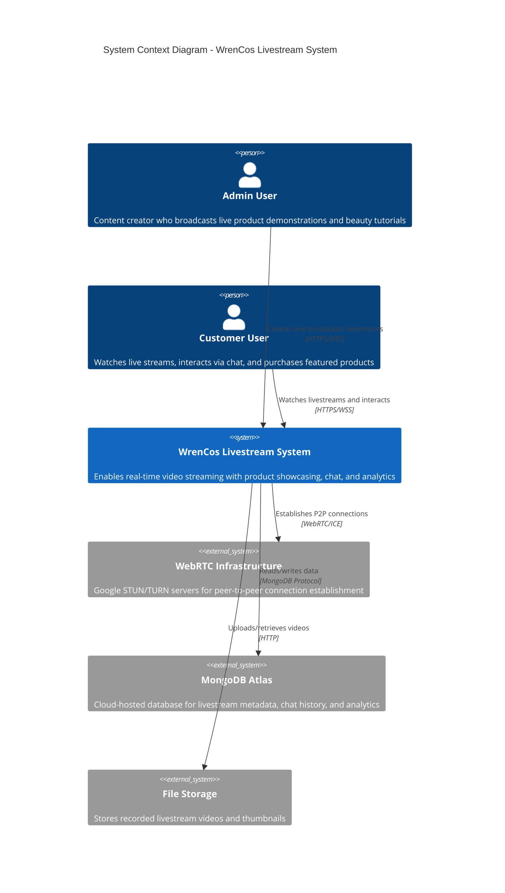
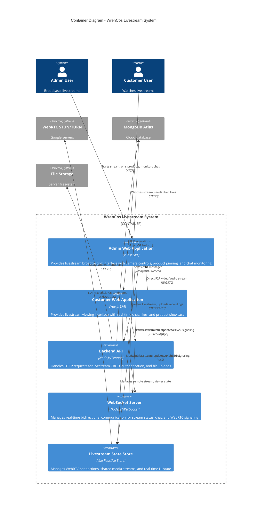
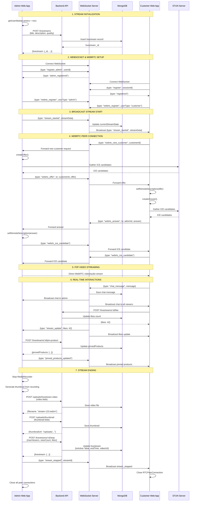
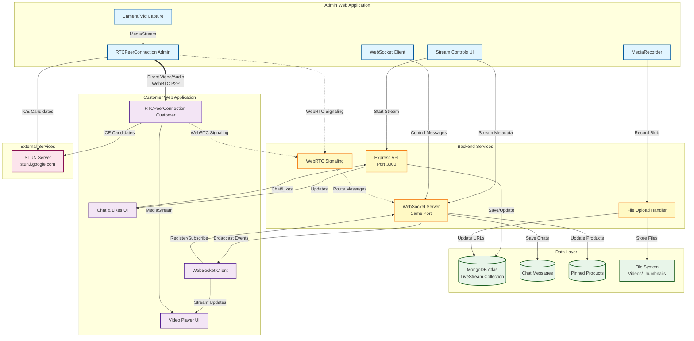
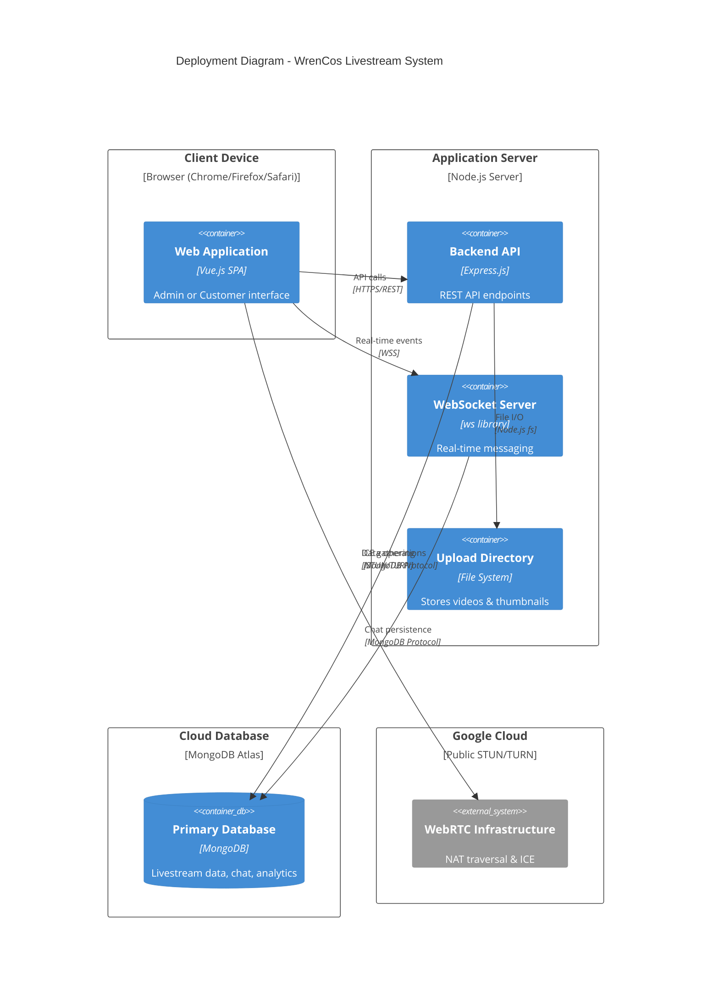

# WrenCos Livestream System - C4 Diagrams

## System Context Diagram (Level 1)



---

## Container Diagram (Level 2)



---

## Component Diagram (Level 3) - Livestream Flow

```mermaid
C4Component
    title Component Diagram - Livestream Broadcasting & Viewing Flow

    Container_Boundary(adminWeb, "Admin Web Application") {
        Component(adminUI, "Admin Livestream UI", "Vue Component", "Camera preview, stream controls, product management")
        Component(mediaCapture, "Media Capture", "MediaDevices API", "Captures camera and microphone input")
        Component(mediaRecorder, "Media Recorder", "MediaRecorder API", "Records stream for later playback")
        Component(adminWS, "Admin WebSocket Client", "WebSocket", "Sends stream control messages")
        Component(adminRTC, "Admin RTC Manager", "RTCPeerConnection", "Broadcasts to multiple customers")
    }

    Container_Boundary(backend, "Backend Services") {
        Component(livestreamAPI, "Livestream API", "Express Router", "CRUD endpoints for livestreams")
        Component(wsManager, "WebSocket Manager", "WebSocketManager class", "Connection management and message routing")
        Component(rtcSignaling, "WebRTC Signaling", "WebSocket handlers", "Coordinates offer/answer/ICE exchange")
        Component(uploadHandler, "Upload Handler", "Multer middleware", "Processes video/thumbnail uploads")
        Component(livestreamModel, "Livestream Model", "Mongoose Schema", "Database operations")
    }

    Container_Boundary(customerWeb, "Customer Web Application") {
        Component(customerUI, "Customer Livestream UI", "Vue Component", "Video player, chat, likes, products")
        Component(videoPlayer, "Video Player", "HTML5 Video", "Displays live or recorded stream")
        Component(customerWS, "Customer WebSocket Client", "WebSocket", "Receives stream updates")
        Component(customerRTC, "Customer RTC Manager", "RTCPeerConnection", "Receives stream from admin")
    }

    System_Ext(mongodb, "MongoDB Atlas")
    System_Ext(stunServer, "STUN Server")

    ' Admin flow
    Rel(adminUI, mediaCapture, "getUserMedia()")
    Rel(mediaCapture, adminUI, "MediaStream")
    Rel(adminUI, mediaRecorder, "Starts/stops recording")
    Rel(adminUI, adminWS, "Sends start_stream, stop_stream")
    Rel(adminUI, livestreamAPI, "POST /livestreams (create)")
    
    Rel(mediaCapture, adminRTC, "Attaches MediaStream tracks")
    Rel(adminRTC, rtcSignaling, "Sends offers via WebSocket")
    Rel(adminRTC, stunServer, "ICE candidate gathering")
    
    Rel(adminWS, wsManager, "stream_started, pinned_products")
    Rel(mediaRecorder, uploadHandler, "Uploads recorded blob")
    
    ' Backend processing
    Rel(livestreamAPI, livestreamModel, "Save/update livestream")
    Rel(livestreamModel, mongodb, "Persist data")
    Rel(wsManager, rtcSignaling, "Routes WebRTC messages")
    Rel(uploadHandler, livestreamModel, "Updates videoUrl")
    
    ' Customer flow
    Rel(customerUI, livestreamAPI, "GET /livestreams/:id")
    Rel(customerUI, customerWS, "Connects and registers")
    Rel(customerWS, wsManager, "Receives stream_started")
    Rel(wsManager, customerWS, "Broadcasts updates")
    
    Rel(customerWS, customerRTC, "Triggers WebRTC connection")
    Rel(customerRTC, rtcSignaling, "Sends answers via WebSocket")
    Rel(customerRTC, stunServer, "ICE candidate gathering")
    
    Rel(rtcSignaling, customerRTC, "Forwards offers from admin")
    Rel(adminRTC, customerRTC, "Direct P2P media stream", "WebRTC")
    Rel(customerRTC, videoPlayer, "Sets srcObject")
    Rel(videoPlayer, customerUI, "Displays video")

    UpdateLayoutConfig($c4ShapeInRow="3", $c4BoundaryInRow="1")
```

---

## Sequence Diagram - Complete Livestream Flow



---

## Data Flow Diagram - Key Interactions



---

## Deployment Diagram



---

## Technology Stack Summary

### Frontend (Admin & Customer Web Apps)
- **Framework**: Vue.js 3 with Composition API
- **State Management**: Reactive Store (`livestreamStore.js`)
- **HTTP Client**: Axios
- **WebSocket**: Native WebSocket API
- **WebRTC**: RTCPeerConnection API
- **Media**: MediaDevices API, MediaRecorder API
- **UI**: Tailwind CSS

### Backend
- **Runtime**: Node.js
- **Framework**: Express.js
- **WebSocket**: `ws` library
- **Database ODM**: Mongoose
- **File Upload**: Multer
- **Authentication**: JWT (JSON Web Tokens)

### Database & Storage
- **Database**: MongoDB Atlas (Cloud)
- **File Storage**: Local filesystem (`uploads/livestreams/`)

### External Services
- **WebRTC**: Google STUN servers (`stun.l.google.com:19302`)
- **NAT Traversal**: ICE (Interactive Connectivity Establishment)

### Communication Protocols
- **REST API**: HTTPS for CRUD operations
- **WebSocket**: WSS for real-time bidirectional messaging
- **WebRTC**: Peer-to-peer media streaming (UDP/SRTP)
- **MongoDB Protocol**: Database communication

---

## Key Architectural Decisions

### 1. **Hybrid Architecture: REST + WebSocket + WebRTC**
   - **REST**: Stateless operations (create livestream, fetch history)
   - **WebSocket**: Real-time signaling and metadata updates
   - **WebRTC**: Efficient P2P video/audio streaming

### 2. **WebRTC for Video Streaming (Not Server-Relayed)**
   - Direct peer-to-peer connections reduce server bandwidth
   - Lower latency for live video
   - Scalable: Server only handles signaling, not media

### 3. **Centralized State Management**
   - `livestreamStore.js` manages all WebRTC connections
   - Single source of truth for stream state
   - Reactive updates to UI components

### 4. **Recording for VOD (Video on Demand)**
   - MediaRecorder captures live stream
   - Automatically uploaded after stream ends
   - Thumbnails generated client-side using Canvas API

### 5. **Separation of Concerns**
   - Admin app: Broadcasting, product management, analytics
   - Customer app: Viewing, chat, likes, purchases
   - Backend: Orchestration, persistence, signaling

---

## Security Considerations

1. **Authentication**: JWT tokens for API and WebSocket connections
2. **Authorization**: Role-based access (admin vs customer)
3. **HTTPS/WSS**: Encrypted communication channels
4. **SRTP**: Encrypted WebRTC media streams
5. **Input Validation**: API request sanitization
6. **Rate Limiting**: Express rate limiter on API endpoints
7. **CORS**: Configured origin restrictions

---

## Scalability Considerations

### Current Architecture (Single Server)
- WebSocket connections: ~1,000 concurrent
- WebRTC: P2P reduces server load
- Bottleneck: Signaling and file uploads

### Future Improvements
1. **Horizontal Scaling**: Multiple backend instances with Redis for WebSocket pub/sub
2. **CDN**: Serve recorded videos via CDN (CloudFront, Cloudflare)
3. **Media Server**: Integrate SFU (Selective Forwarding Unit) like Janus or Mediasoup
4. **Database Sharding**: Partition livestream data by date/region
5. **Load Balancer**: Nginx or AWS ALB for traffic distribution
