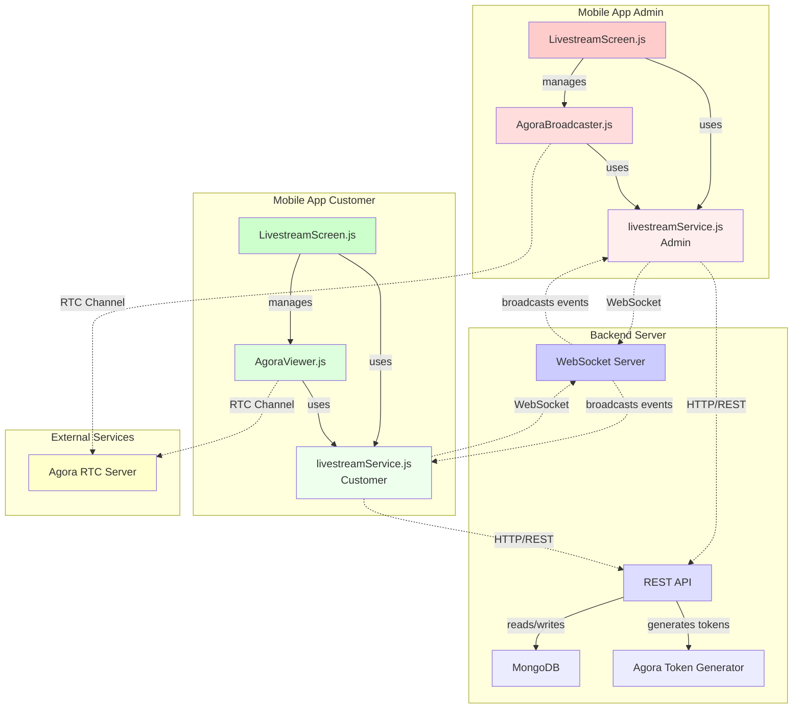
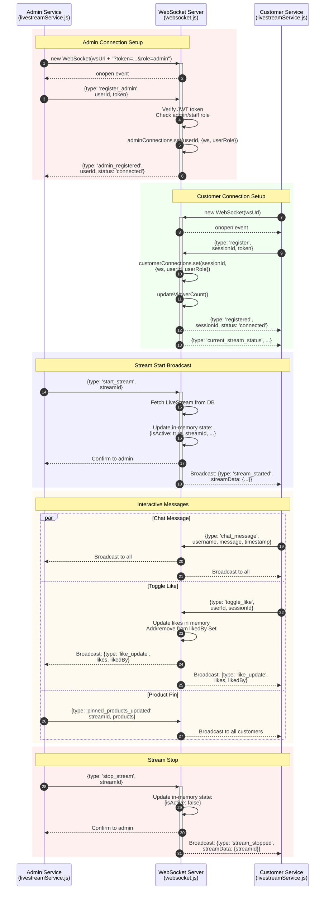
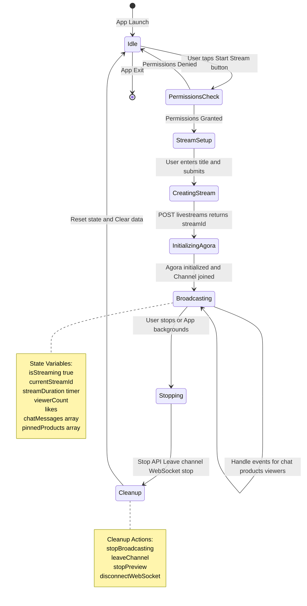
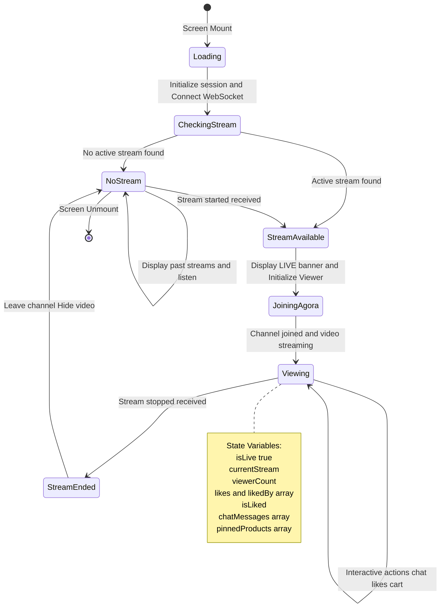
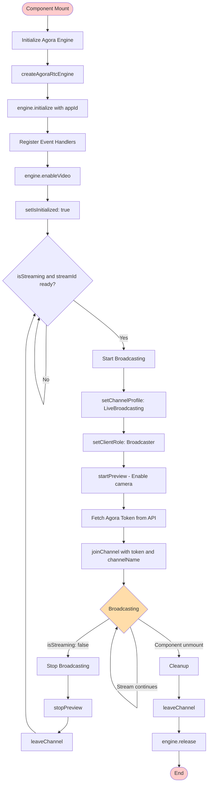
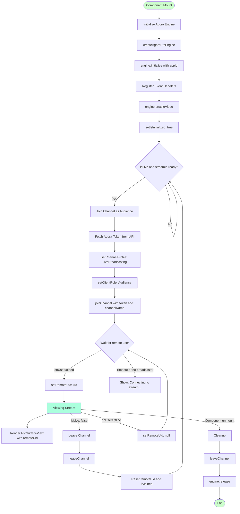
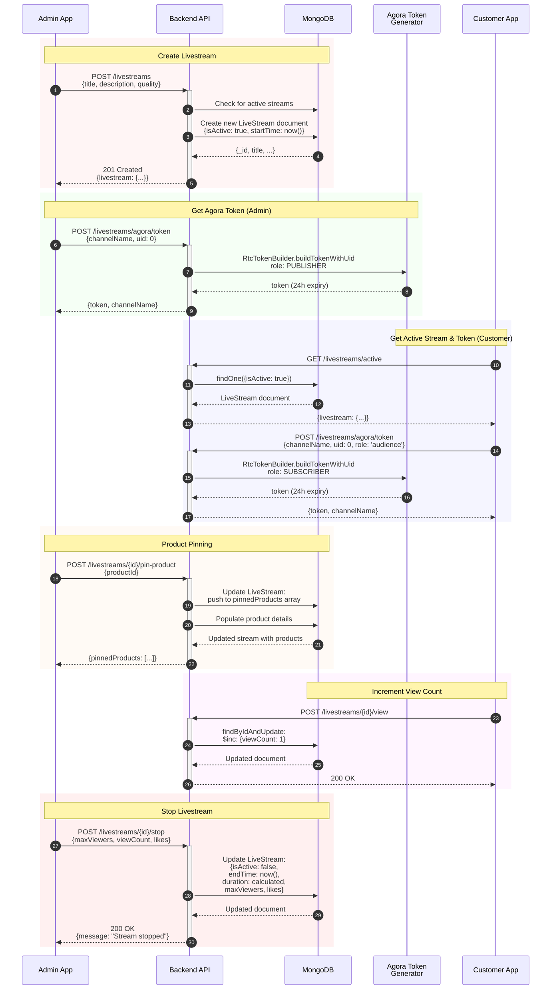
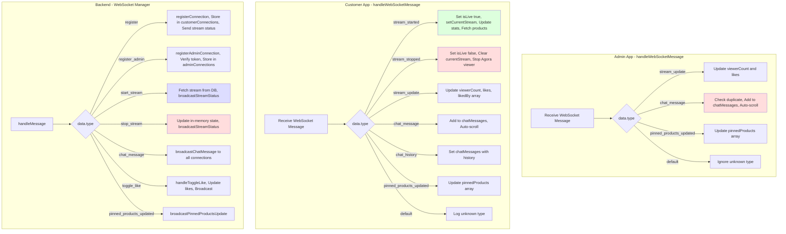

# Mobile Livestream Architecture - Detailed Code Flow

This document provides comprehensive diagrams explaining how the livestream code works between Mobile App Admin and Mobile App Customer, based on the actual implementation in the codebase.

```mermaid
sequenceDiagram
    autonumber
    participant Admin as Mobile App Admin<br/>(Broadcaster)
    participant AgoraBroadcaster as Agora Broadcaster<br/>Component
    participant Backend as Backend Server<br/>(Node.js)
    participant WebSocket as WebSocket Server
    participant AgoraServer as Agora RTC Server
    participant Customer as Mobile App Customer<br/>(Viewer)
    participant AgoraViewer as Agora Viewer<br/>Component

    rect rgb(230, 240, 255)
    Note over Admin,Backend: Stream Setup Phase
    Admin->>+Backend: POST /livestreams<br/>{title, description, quality}
    Backend->>Backend: Check for active streams
    Backend->>Backend: Create LiveStream in DB<br/>(status: active)
    Backend-->>-Admin: 201 Created<br/>{livestream: {_id, title, ...}}
    Admin->>Admin: Store streamId<br/>Show stream UI
    end

    rect rgb(255, 240, 230)
    Note over Admin,AgoraServer: Initialize Agora Broadcasting
    Admin->>+AgoraBroadcaster: Initialize with streamId
    AgoraBroadcaster->>AgoraBroadcaster: Create Agora RTC Engine
    AgoraBroadcaster->>AgoraBroadcaster: Set Channel Profile:<br/>Live Broadcasting
    AgoraBroadcaster->>AgoraBroadcaster: Set Client Role:<br/>Broadcaster
    AgoraBroadcaster->>+Backend: POST /livestreams/agora/token<br/>{channelName, uid: 0}
    Backend->>Backend: Generate Agora Token<br/>(RtcTokenBuilder)
    Backend-->>-AgoraBroadcaster: {token, channelName}
    AgoraBroadcaster->>AgoraBroadcaster: Start camera preview
    AgoraBroadcaster->>+AgoraServer: Join Channel<br/>(token, channelName, uid: 0)
    AgoraServer-->>-AgoraBroadcaster: Channel joined successfully
    AgoraBroadcaster-->>-Admin: Broadcasting started
    end

    rect rgb(240, 255, 240)
    Note over Admin,Customer: WebSocket Real-time Updates
    Admin->>+WebSocket: WebSocket: start_stream<br/>{streamId}
    WebSocket->>Backend: Fetch stream data from DB
    Backend-->>WebSocket: LiveStream document
    WebSocket->>WebSocket: Update in-memory state<br/>{isActive: true, viewerCount: 0}
    WebSocket-->>Customer: Broadcast: stream_started<br/>{streamData: {...}}
    WebSocket-->>-Admin: Stream started confirmed
    end

    rect rgb(255, 250, 240)
    Note over Customer,AgoraServer: Customer Joins Stream
    Customer->>Customer: Receive stream_started<br/>via WebSocket
    Customer->>Customer: Display "LIVE" banner<br/>Show stream info
    Customer->>+WebSocket: WebSocket: register<br/>{sessionId, token}
    WebSocket->>WebSocket: Store customer connection<br/>Increment viewerCount
    WebSocket-->>Admin: Broadcast: viewer_count<br/>{count: 1}
    WebSocket-->>-Customer: Registration confirmed
    
    Customer->>+AgoraViewer: Initialize with streamId
    AgoraViewer->>AgoraViewer: Create Agora RTC Engine
    AgoraViewer->>AgoraViewer: Set Channel Profile:<br/>Live Broadcasting
    AgoraViewer->>AgoraViewer: Set Client Role:<br/>Audience
    AgoraViewer->>+Backend: POST /livestreams/agora/token<br/>{channelName, uid: 0, role: 'audience'}
    Backend->>Backend: Generate Agora Token<br/>(Subscriber role)
    Backend-->>-AgoraViewer: {token, channelName}
    AgoraViewer->>+AgoraServer: Join Channel<br/>(token, channelName, uid: 0)
    AgoraServer-->>-AgoraViewer: Channel joined
    AgoraServer->>AgoraViewer: Stream remote video<br/>(from broadcaster uid)
    AgoraViewer-->>-Customer: Display live video
    
    Customer->>+Backend: POST /livestreams/{id}/view
    Backend->>Backend: Increment view count in DB
    Backend-->>-Customer: View recorded
    end

    rect rgb(250, 240, 255)
    Note over Admin,Customer: Interactive Features
    
    par Product Pinning
        Admin->>+Backend: POST /livestreams/{id}/pin-product<br/>{productId}
        Backend->>Backend: Add product to pinned list
        Backend-->>-Admin: Product pinned
        Admin->>+WebSocket: WebSocket: pinned_products_updated<br/>{streamId, products}
        WebSocket-->>Customer: Broadcast: pinned_products_updated
        WebSocket-->>-Admin: Update confirmed
        Customer->>Customer: Display pinned products
    and Chat Messages
        Customer->>+WebSocket: WebSocket: chat_message<br/>{streamId, message, username}
        WebSocket-->>Admin: Broadcast: new_message<br/>{message, username, timestamp}
        WebSocket-->>-Customer: Broadcast: new_message
        Admin->>Admin: Display chat message
        Customer->>Customer: Display chat message
    and Like/Unlike
        Customer->>+WebSocket: WebSocket: toggle_like<br/>{streamId, userId/sessionId}
        WebSocket->>WebSocket: Update likes in memory<br/>Add/remove from likedBy set
        WebSocket-->>Admin: Broadcast: like_update<br/>{likes, likedBy}
        WebSocket-->>-Customer: Broadcast: like_update
        Admin->>Admin: Update like count display
        Customer->>Customer: Update like button state
    end
    end

    rect rgb(255, 240, 240)
    Note over Admin,Customer: Stream Termination
    Admin->>+AgoraBroadcaster: Stop broadcasting
    AgoraBroadcaster->>AgoraBroadcaster: Stop camera preview
    AgoraBroadcaster->>+AgoraServer: Leave channel
    AgoraServer-->>-AgoraBroadcaster: Channel left
    AgoraBroadcaster-->>-Admin: Broadcasting stopped
    
    Admin->>+Backend: POST /livestreams/{id}/stop<br/>{maxViewers, viewCount, likes}
    Backend->>Backend: Update LiveStream in DB<br/>{isActive: false, endTime, duration}
    Backend-->>-Admin: 200 OK<br/>{message: "Stream stopped"}
    
    Admin->>+WebSocket: WebSocket: stop_stream<br/>{streamId}
    WebSocket->>WebSocket: Update in-memory state<br/>{isActive: false}
    WebSocket-->>Customer: Broadcast: stream_stopped<br/>{streamId}
    WebSocket-->>-Admin: Stop confirmed
    
    Customer->>Customer: Hide LIVE banner<br/>Show "Stream ended"
    Customer->>+AgoraViewer: Stop viewing
    AgoraViewer->>+AgoraServer: Leave channel
    AgoraServer-->>-AgoraViewer: Channel left
    AgoraViewer-->>-Customer: Viewing stopped
    
    Customer->>+Backend: GET /livestreams/past
    Backend->>Backend: Query completed streams
    Backend-->>-Customer: {livestreams: [past streams]}
    Customer->>Customer: Display past streams list
    end
```



## Key Technologies

### Agora RTC (Real-Time Communication)
- **For Admin**: Uses `ClientRoleType.ClientRoleBroadcaster` to publish video/audio
- **For Customer**: Uses `ClientRoleType.ClientRoleAudience` to subscribe to video/audio
- **Token-based authentication**: Backend generates tokens with appropriate privileges
- **Channel-based**: Both broadcaster and viewers join the same channel using streamId

### WebSocket (Real-Time Updates)
- **Connection Management**: Separate maps for admin and customer connections
- **Real-time Events**: 
  - `stream_started` / `stream_stopped`
  - `chat_message`
  - `toggle_like`
  - `pinned_products_updated`
  - `viewer_count`
- **In-memory State**: Maintains current stream state for instant updates

### Backend API
- **RESTful Endpoints**: CRUD operations for livestreams
- **Database**: MongoDB with LiveStream model
- **Authentication**: JWT tokens for admin actions
- **Optional Auth**: Customers can view without login (uses sessionId)

## Flow Summary

1. **Admin starts stream**: Creates livestream record, initializes Agora broadcaster, broadcasts via WebSocket
2. **Customers receive notification**: WebSocket notifies all connected customers of new stream
3. **Customers join**: Connect to Agora channel as audience, receive video stream
4. **Interactive features**: Chat, likes, and product pins synchronized via WebSocket
5. **Admin stops stream**: Leaves Agora channel, updates database, broadcasts stop event
6. **Customers notified**: Receive stop event, leave channel, can view past streams

---

## Additional Detailed Diagrams

### 1. Component Architecture Diagram



### 2. WebSocket Connection & Message Flow



### 3. Admin Livestream Lifecycle (State Machine)



### 4. Customer Viewing Flow (State Machine)



### 5. Agora Broadcasting Implementation (Admin)



### 6. Agora Viewing Implementation (Customer)



### 7. Data Flow - REST API Calls



### 8. WebSocket Event Handlers (Code-level)



## Key Implementation Details

### Admin Service (livestreamService.js)
```javascript
// Connection
connectWebSocket(token)
  ├─> new WebSocket(wsUrl + "?token=...&role=admin")
  ├─> onopen: send {type: 'register_admin', userId, token}
  ├─> onmessage: notify all messageHandlers
  └─> attemptReconnect on close

// Core Methods
createLivestream(data) → POST /livestreams
stopLivestream(streamId, data) → POST /livestreams/{id}/stop
getAgoraToken(channelName, uid) → POST /livestreams/agora/token

// WebSocket Actions
startStream(streamId) → send {type: 'start_stream', streamId}
stopStream(streamId) → send {type: 'stop_stream', streamId}
sendChatMessage(message, username) → send {type: 'chat_message', ...}
```

### Customer Service (livestreamService.js)
```javascript
// Connection
connectWebSocket(token)
  ├─> new WebSocket(wsUrl)
  ├─> onopen: send {type: 'register', sessionId, token}
  ├─> onmessage: notify all messageHandlers
  └─> attemptReconnect with exponential backoff

// Core Methods
getActiveStream() → GET /livestreams/active
getPastStreams(limit) → GET /livestreams/past?limit={limit}
getPinnedProducts(streamId) → GET /livestreams/{id}/pinned-products
incrementViewCount(streamId) → POST /livestreams/{id}/view

// WebSocket Actions
sendChatMessage(message, username) → send {type: 'chat_message', ...}
toggleLike(userId, sessionId) → send {type: 'toggle_like', ...}
```

### State Management

**Admin LivestreamScreen State:**
- `isStreaming`: boolean - Broadcasting status
- `currentStreamId`: string - Active stream ID
- `streamDuration`: number - Timer in seconds
- `viewerCount`, `likes`: numbers - Real-time stats
- `chatMessages[]`: Array of message objects
- `pinnedProducts[]`: Array of pinned products
- `showStreamSetup`: boolean - Modal visibility

**Customer LivestreamScreen State:**
- `isLive`: boolean - Whether stream is active
- `currentStream`: object - Stream data
- `viewerCount`, `likes`, `likedBy[]`: Real-time stats
- `isLiked`: boolean - Current user's like status
- `chatMessages[]`: Array of message objects
- `pinnedProducts[]`: Array of pinned products
- `pastStreams[]`: Array of completed streams

### Component Lifecycle

**AgoraBroadcaster:**
1. Mount → Initialize engine → Register handlers
2. isStreaming=true → Start broadcasting → Join channel
3. isStreaming=false → Stop broadcasting → Leave channel
4. Unmount → Cleanup → Release engine

**AgoraViewer:**
1. Mount → Initialize engine → Register handlers
2. isLive=true + streamId → Join channel as audience
3. onUserJoined → Render remote video
4. isLive=false → Leave channel
5. Unmount → Cleanup → Release engine
