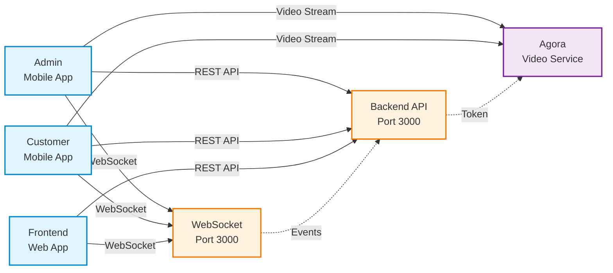

# Simple System Connections

## Connection Types:

**Solid lines (→)**: Active data flow
- REST API: HTTP requests/responses
- WebSocket: Real-time bidirectional messages
- Video Stream: Direct RTC connection

**Dotted lines (-.->)**: Coordination/Support
- Backend generates tokens for Agora
- WebSocket shares state with Backend
