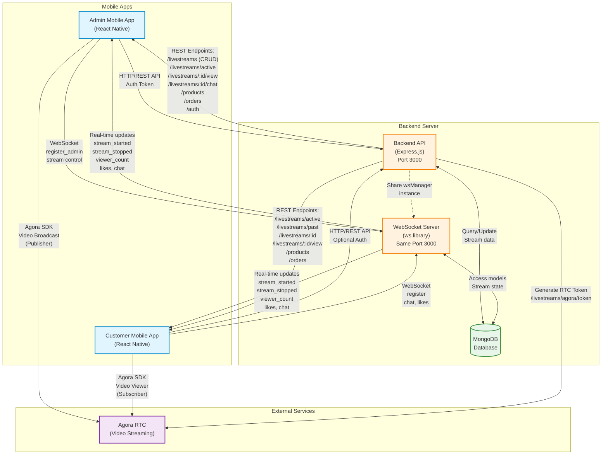

# WrenCOS System Connections Diagram

This diagram shows the connections between Backend API, Agora, Admin App, Customer App, and WebSocket.

## Connection Details

### Admin Mobile App
- **REST API**: Authenticates with JWT token, manages livestreams (create, update, stop)
- **WebSocket**: Registers as admin, sends stream control messages (start_stream, stop_stream)
- **Agora SDK**: Uses `ClientRoleBroadcaster` to publish video stream to channel

### Customer Mobile App
- **REST API**: Fetches active/past streams, products, optional authentication
- **WebSocket**: Registers with sessionId, sends chat messages, likes, receives real-time updates
- **Agora SDK**: Uses `ClientRoleAudience` to subscribe to video stream from channel

### Backend API (Express.js)
- **HTTP Server**: Runs on port 3000, provides REST endpoints for all operations
- **Routes**: Authentication, livestreams, products, orders, analytics, chat, payments, etc.
- **Token Generation**: Generates Agora RTC tokens using AGORA_APP_ID and AGORA_APP_CERTIFICATE

### WebSocket Server
- **Same Port**: Runs on same port 3000 as HTTP server (WebSocket upgrade)
- **Connection Types**: Tracks admin connections (by userId) and customer connections (by sessionId)
- **Real-time Broadcasting**: 
  - `stream_started` / `stream_stopped`: Notifies all clients when stream state changes
  - `stream_update`: Updates viewer count, likes, quality
  - `chat_message`: Broadcasts chat to all viewers
  - `toggle_like`: Updates like count in real-time
  - `pinned_products_updated`: Notifies when products are pinned during stream

### Agora RTC
- **Video Streaming**: Handles real-time video transmission
- **Channel-based**: Each livestream has unique channel name (derived from streamId)
- **Roles**: 
  - Broadcaster (Admin) - publishes video
  - Audience (Customer) - subscribes to video
- **Token Auth**: Requires token from backend for secure channel access
