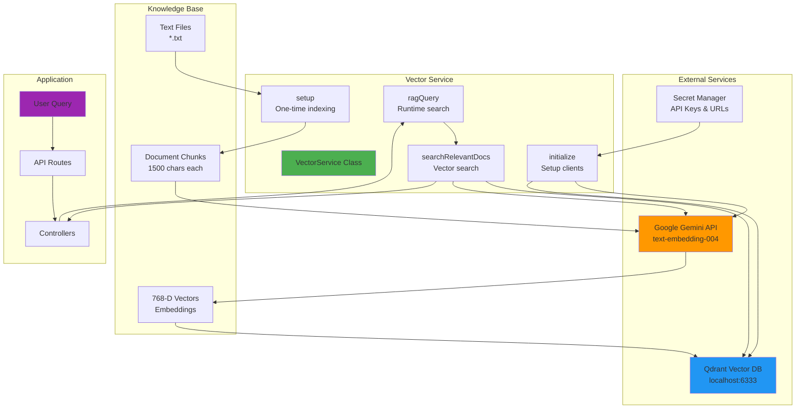
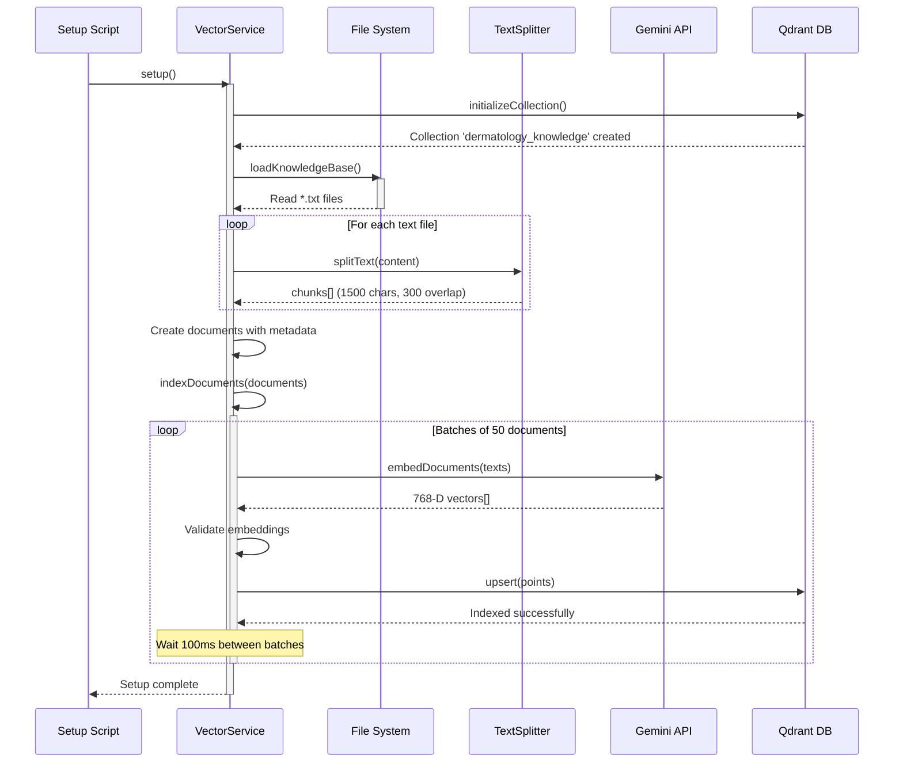
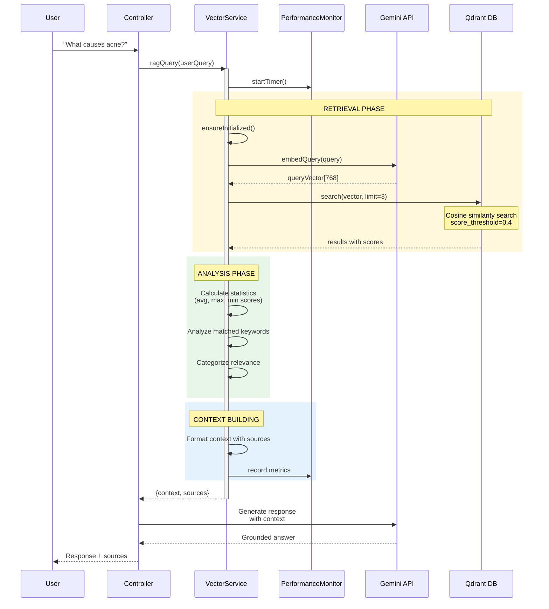
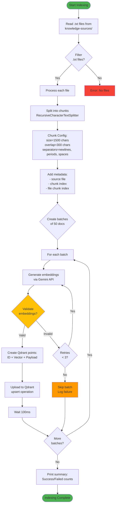
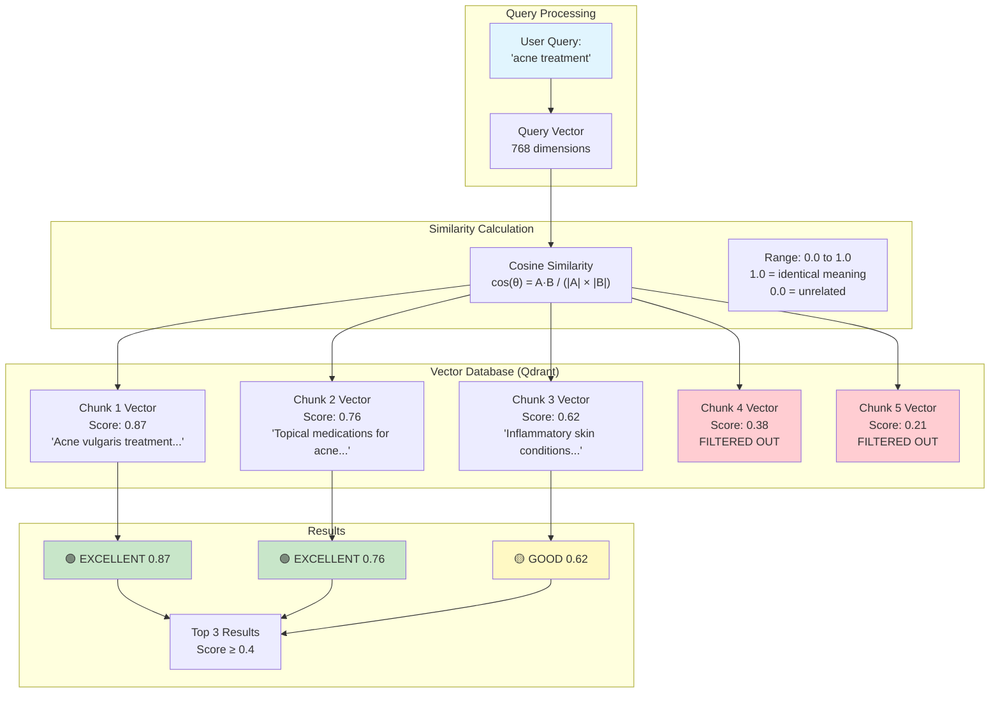
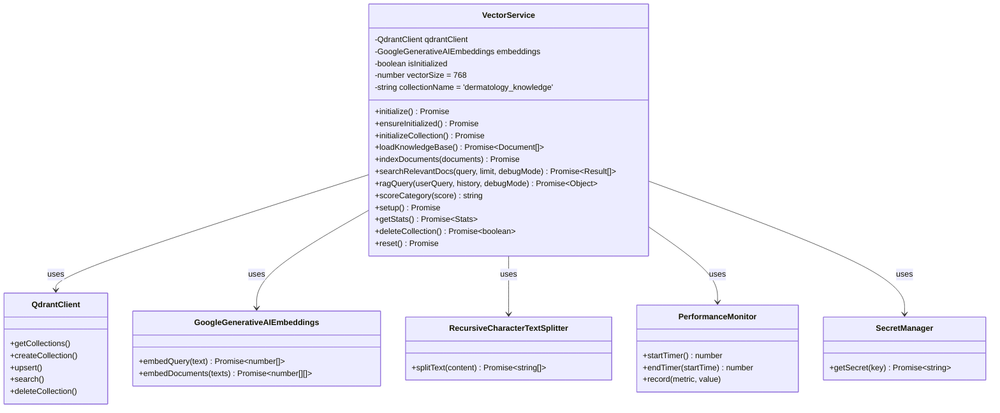
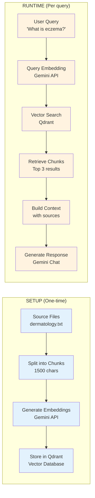
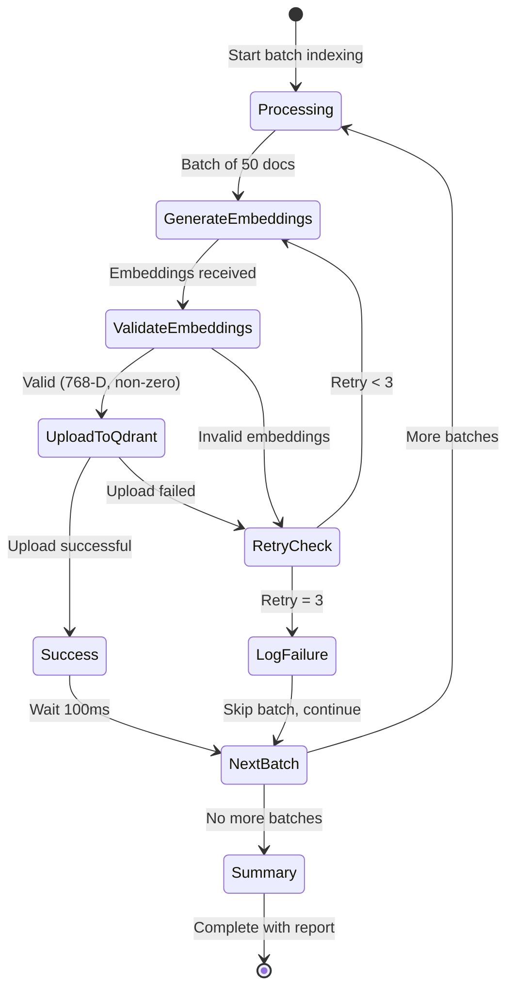
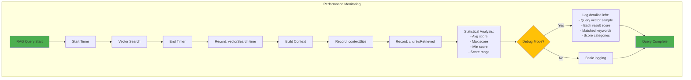

# Vector Service Architecture Diagrams

## 1. Overall System Architecture

## 2. One-Time Setup Flow

## 3. RAG Query Pipeline (Runtime)

```mermaid
flowchart LR
    subgraph "1. User Input"
        Q[User Query:<br/>'What is acne?']
    end
    
    subgraph "2. Query Embedding"
        QE[Convert to Vector<br/>768 dimensions]
        Gemini1[Gemini API<br/>embedQuery]
    end
    
    subgraph "3. Vector Search"
        VS[Cosine Similarity<br/>Search]
        Filter[Filter > 0.4<br/>threshold]
        Top[Top 3 Chunks]
    end
    
    subgraph "4. Context Building"
        Chunks[Retrieved Chunks<br/>with metadata]
        Context[Formatted Context<br/>with sources]
    end
    
    subgraph "5. AI Response"
        Gemini2[Gemini Chat<br/>with context]
        Answer[Grounded Answer<br/>+ citations]
    end
    
    Q --> QE
    QE --> Gemini1
    Gemini1 --> VS
    VS --> Filter
    Filter --> Top
    Top --> Chunks
    Chunks --> Context
    Context --> Gemini2
    Gemini2 --> Answer
    
    style Q fill:#E1F5FE
    style Answer fill:#C8E6C9
    style VS fill:#FFF9C4
```

## 4. Detailed RAG Query Sequence

## 5. Document Indexing Process

## 6. Vector Similarity Search Explained

## 7. Class Structure and Methods

## 8. Data Flow - Setup vs Runtime

## 9. Error Handling and Retry Logic

## 10. Performance Metrics Tracking

---

## Key Technical Details

### Vector Dimensions
- **Size**: 768 dimensions (Gemini text-embedding-004)
- **Distance Metric**: Cosine similarity
- **Range**: 0.0 (unrelated) to 1.0 (identical)

### Chunking Strategy
- **Size**: 1500 characters per chunk
- **Overlap**: 300 characters between chunks
- **Separators**: `['\n\n', '\n', '. ', ' ', '']`

### Batch Processing
- **Batch Size**: 50 documents
- **Retry Logic**: 3 attempts per batch
- **Delay**: 100ms between batches, 2000ms between retries

### Search Configuration
- **Default Limit**: 3 chunks (optimized from 5)
- **Score Threshold**: 0.4 (40% similarity minimum)
- **Payload**: Includes full text + metadata

### Score Categories
- 🟢 **PERFECT**: 0.90-1.00
- 🟢 **EXCELLENT**: 0.75-0.89
- 🟡 **GOOD**: 0.60-0.74
- 🟡 **FAIR**: 0.45-0.59
- 🔴 **WEAK**: 0.30-0.44
- ⚫ **POOR**: < 0.30
