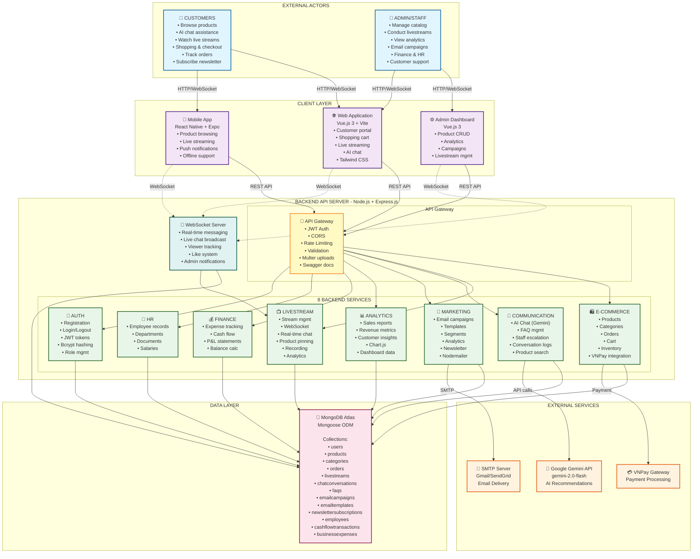
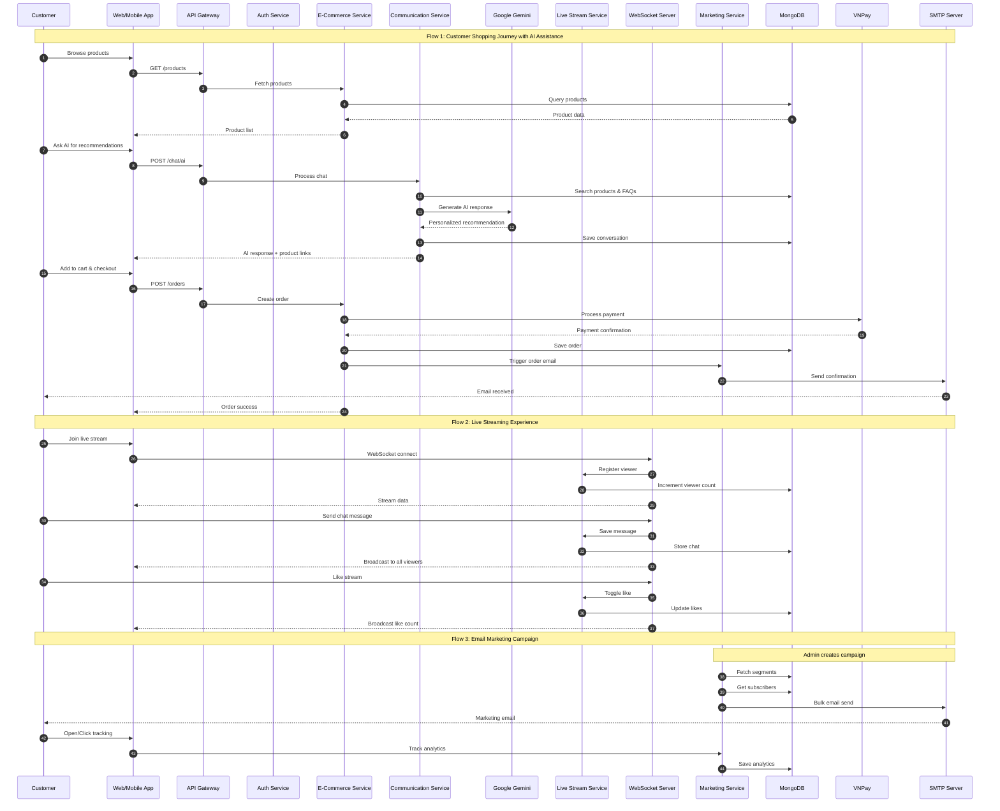
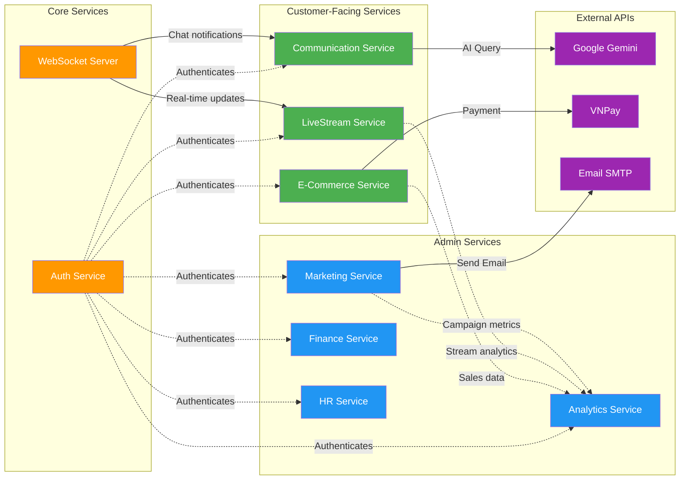
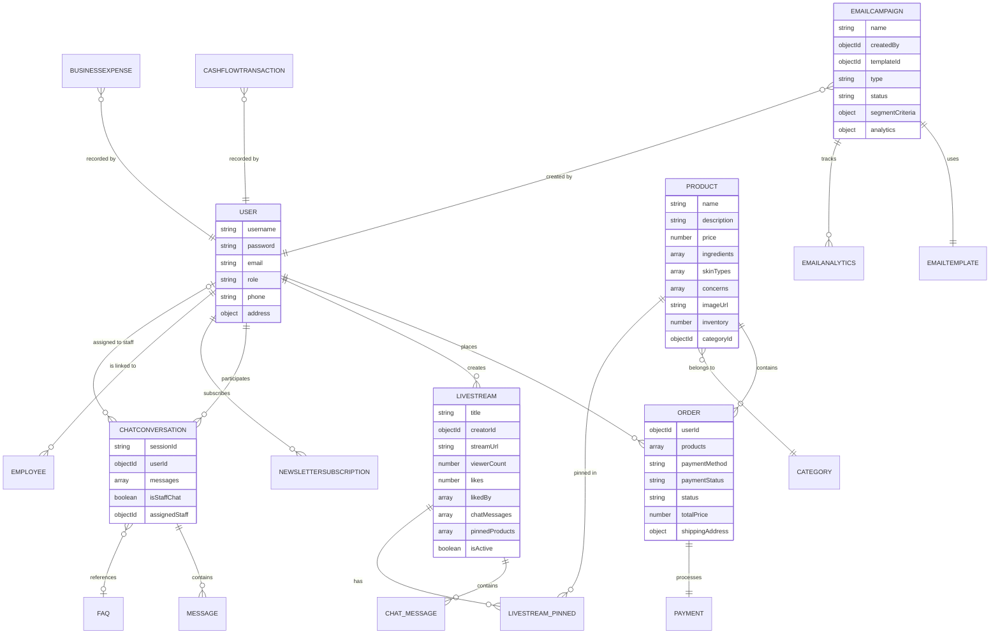
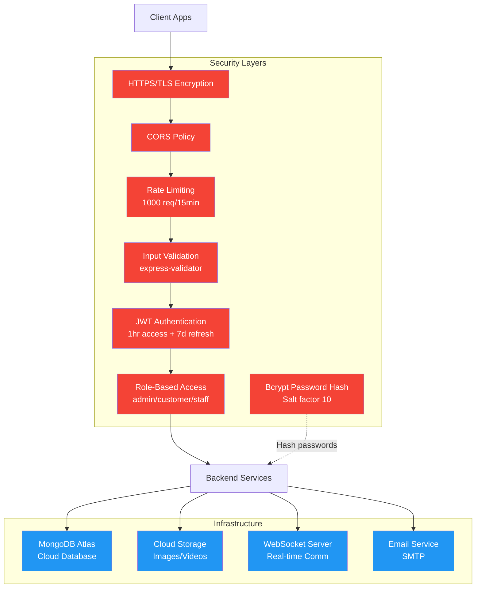

# Wrencos Platform - Rich Picture Diagram

This Rich Picture provides a comprehensive visual overview of the Wrencos e-commerce platform, showing all actors, systems, services, and interactions.

## System Overview Diagram

## Key Data Flows

## Service Interaction Map

## Technology Stack Overview

```mermaid
graph TB
    subgraph "Frontend Technologies"
        VueJS["Vue.js 3.5.12<br/>Composition API"]
        Vite["Vite 5.4.10<br/>Build Tool"]
        Tailwind["Tailwind CSS 3.4.14<br/>Styling"]
        VueRouter["Vue Router 4.4.5<br/>SPA Routing"]
        ChartJS["Chart.js 4.5.0<br/>Analytics Viz"]
        VueI18n["Vue I18n 11.0<br/>Multi-language"]
        Axios1["Axios 1.7.7<br/>HTTP Client"]
    end
    
    subgraph "Mobile Technologies"
        RN["React Native 0.73.6<br/>Cross-platform"]
        Expo["Expo 50.0<br/>Dev Platform"]
        RNav["React Navigation 6.1.9<br/>Navigation"]
        AsyncStor["AsyncStorage 1.21.0<br/>Local Storage"]
        VectorIcons["Vector Icons 10.0.3<br/>UI Icons"]
        Axios2["Axios 1.6.2<br/>HTTP Client"]
    end
    
    subgraph "Backend Technologies"
        NodeJS["Node.js 18+<br/>Runtime"]
        Express["Express.js 4.19.2<br/>Web Framework"]
        WS["WebSocket ws 8.18.3<br/>Real-time"]
        JWT["JWT 9.0.2<br/>Authentication"]
        Bcrypt["Bcryptjs 2.4.3<br/>Password Hash"]
        Mongoose["Mongoose 8.5.2<br/>MongoDB ODM"]
        GeminiSDK["@google/generative-ai 0.24.1<br/>AI Integration"]
        Nodemailer["Nodemailer 7.0.9<br/>Email Service"]
        Multer["Multer 1.4.5<br/>File Upload"]
        RateLimit["express-rate-limit 7.4.0<br/>API Protection"]
        Swagger["Swagger 6.2.8<br/>API Docs"]
        NodeCron["node-cron 4.2.1<br/>Task Scheduler"]
    end
    
    subgraph "Database & Cloud"
        MongoDB["MongoDB Atlas 8.0+<br/>NoSQL Database"]
        Cloud["Cloud Storage<br/>File Hosting"]
    end
    
    VueJS --> Vite
    VueJS --> Tailwind
    VueJS --> VueRouter
    VueJS --> ChartJS
    VueJS --> VueI18n
    VueJS --> Axios1
    
    RN --> Expo
    RN --> RNav
    RN --> AsyncStor
    RN --> VectorIcons
    RN --> Axios2
    
    NodeJS --> Express
    Express --> WS
    Express --> JWT
    Express --> Bcrypt
    Express --> Mongoose
    Express --> GeminiSDK
    Express --> Nodemailer
    Express --> Multer
    Express --> RateLimit
    Express --> Swagger
    Express --> NodeCron
    
    Mongoose --> MongoDB
    Multer --> Cloud
    
    Axios1 -.->|API Calls| Express
    Axios2 -.->|API Calls| Express
    
    classDef frontendTech fill:#42b983,color:#fff
    classDef mobileTech fill:#61dafb,color:#000
    classDef backendTech fill:#68a063,color:#fff
    classDef dataTech fill:#4db33d,color:#fff
    
    class VueJS,Vite,Tailwind,VueRouter,ChartJS,VueI18n,Axios1 frontendTech
    class RN,Expo,RNav,AsyncStor,VectorIcons,Axios2 mobileTech
    class NodeJS,Express,WS,JWT,Bcrypt,Mongoose,GeminiSDK,Nodemailer,Multer,RateLimit,Swagger,NodeCron backendTech
    class MongoDB,Cloud dataTech
```

## Data Model Relationships

## Security & Infrastructure

## Key Features Summary

### 🎯 Core Value Propositions
1. **Operational Consolidation**: 8 services unified in one platform (E-Commerce, Live Streaming, Marketing, Analytics, Finance, HR, Communication, Auth)
2. **AI-Powered Personalization**: Google Gemini integration for intelligent product recommendations
3. **Real-Time Engagement**: WebSocket-based live streaming with chat and product pinning
4. **Data-Driven Insights**: Comprehensive analytics across sales, customers, campaigns, and streams
5. **Multi-Platform Access**: Web (Vue.js), Mobile (React Native), Admin Dashboard

### 📊 Technology Highlights
- **Backend**: Node.js + Express.js + WebSocket + MongoDB Atlas
- **Frontend**: Vue.js 3 + Vite + Tailwind CSS
- **Mobile**: React Native 0.73.6 + Expo 50.0
- **AI**: Google Gemini API (gemini-2.0-flash model)
- **Payments**: VNPay Gateway integration
- **Email**: Nodemailer with SMTP (Gmail/SendGrid)
- **Security**: JWT tokens, bcrypt hashing, rate limiting, CORS, input validation

### 🔄 Key Workflows
1. **Shopping**: Browse → AI Chat → Add to Cart → VNPay Checkout → Order Tracking
2. **Live Stream**: Admin broadcasts → Customers watch → Real-time chat → Product pinning → Purchases
3. **AI Chat**: Customer query → FAQ/Product search → Gemini AI → Personalized response
4. **Email Marketing**: Create campaign → Segment audience → Bulk send → Track analytics
5. **Analytics**: Data aggregation → Chart.js visualization → Dashboard insights
