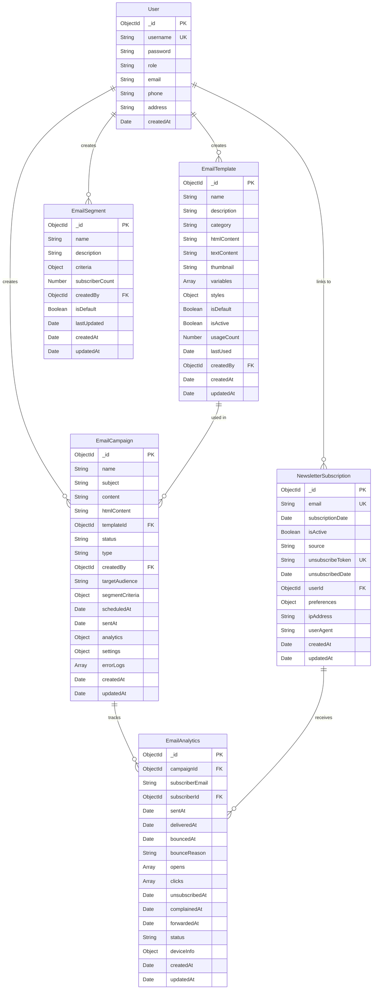

# Marketing Service - Entity Relationship Diagram (ERD)

## Overview
The Marketing Service manages email campaigns, templates, subscriber segments, newsletter subscriptions, and comprehensive email analytics.

## How the Marketing Service Works

The marketing system follows this workflow:

1. **Campaign Setup** → A user creates an email campaign and optionally selects a pre-designed template
2. **Audience Targeting** → The campaign targets subscribers either to all, a specific segment, or custom email list
3. **Campaign Sending** → Once scheduled/sent, the system sends emails to matched subscribers
4. **Engagement Tracking** → Each recipient's activity (opens, clicks, bounces) is tracked in analytics
5. **Performance Analysis** → Data is aggregated to measure campaign success (open rate, click rate, etc.)

**Key Components:**
- **EmailCampaign**: The core entity that contains campaign content, status, and embedded analytics
- **EmailTemplate**: Reusable email designs that campaigns can use to save design time
- **EmailSegment**: Rules to automatically filter subscribers based on criteria (e.g., "users who signed up via checkout")
- **NewsletterSubscription**: Subscriber database with preferences and unsubscribe tracking
- **EmailAnalytics**: Detailed per-recipient tracking of every email event (sent, opened, clicked, bounced, etc.)

## Database Schema Diagram

> **What is an ERD?** An Entity Relationship Diagram (ERD) visually represents the database structure, showing entities (tables/collections), their attributes (fields), and the relationships between them. This diagram uses Mermaid syntax - when rendered in GitHub or VS Code with Mermaid extension, it displays as an interactive visual diagram.



## Entity Descriptions

### 1. User (External Reference)
- **Purpose**: User accounts that create and manage marketing campaigns
- **Key Attributes**:
  - `username`: Unique identifier for login
  - `role`: User role (admin/customer)
  - `email`: User's email address
- **Relationships**:
  - Creates EmailCampaigns
  - Creates EmailTemplates
  - Creates EmailSegments
  - Can link to NewsletterSubscription

### 2. EmailCampaign
- **Purpose**: Represents email marketing campaigns sent to subscribers
- **Key Attributes**:
  - `name`: Campaign name
  - `subject`: Email subject line
  - `content`: Plain text content
  - `htmlContent`: HTML email content
  - `status`: Campaign status (draft/scheduled/sending/sent/paused/cancelled)
  - `type`: Campaign type (newsletter/promotion/announcement/welcome/product_launch/abandoned_cart)
  - `targetAudience`: Targeting method (all/segment/custom)
  - `segmentCriteria`: Criteria for audience targeting
  - `analytics`: Embedded analytics data (recipients, opens, clicks, bounces, etc.)
- **Relationships**:
  - Created by User (Many-to-One)
  - Uses EmailTemplate (Many-to-One, optional)
  - Tracked by EmailAnalytics (One-to-Many)
- **Indexes**: status, type, createdBy, scheduledAt, sentAt

### 3. EmailTemplate
- **Purpose**: Reusable email templates with customizable variables and styles
- **Key Attributes**:
  - `name`: Template name
  - `category`: Template category (newsletter/promotion/announcement/etc.)
  - `htmlContent`: HTML template content
  - `variables`: Array of customizable template variables
  - `styles`: Predefined color and font styles
  - `usageCount`: Track template popularity
- **Relationships**:
  - Created by User (Many-to-One)
  - Used in EmailCampaigns (One-to-Many)
- **Features**:
  - Variable substitution
  - Style customization
  - Usage tracking
- **Indexes**: category, isActive, isDefault, createdBy

### 4. EmailSegment
- **Purpose**: Define subscriber segments based on various criteria for targeted campaigns
- **Key Attributes**:
  - `name`: Segment name
  - `criteria`: Complex filtering criteria (source, date range, email pattern, custom fields)
  - `subscriberCount`: Cached count of matching subscribers
- **Relationships**:
  - Created by User (Many-to-One)
  - Filters NewsletterSubscriptions (logical relationship)
- **Features**:
  - Dynamic subscriber matching
  - Multiple filter operators
  - Auto-updating subscriber counts
- **Indexes**: createdBy + name, isDefault

### 5. NewsletterSubscription
- **Purpose**: Manage newsletter subscriber information and preferences
- **Key Attributes**:
  - `email`: Unique subscriber email
  - `isActive`: Subscription status
  - `source`: Subscription origin (public_page/checkout/manual/other)
  - `unsubscribeToken`: Unique token for unsubscribe links
  - `preferences`: Subscriber preferences (newProducts/promotions/newsletter)
- **Relationships**:
  - Linked to User (Many-to-One, optional)
  - Receives EmailAnalytics (One-to-Many)
- **Features**:
  - Automatic unsubscribe token generation
  - Preference management
  - Source tracking
- **Indexes**: email (unique), isActive, subscriptionDate

### 6. EmailAnalytics
- **Purpose**: Track detailed email engagement metrics per subscriber per campaign
- **Key Attributes**:
  - `campaignId`: Reference to email campaign
  - `subscriberEmail`: Recipient email
  - `status`: Current status (sent/delivered/opened/clicked/bounced/unsubscribed/complained)
  - `opens`: Array of open events with timestamp, IP, location
  - `clicks`: Array of click events with URLs and metadata
  - `deviceInfo`: Device and email client information
- **Relationships**:
  - Tracks EmailCampaign (Many-to-One)
  - Tracks NewsletterSubscription (Many-to-One, optional)
- **Features**:
  - Multi-event tracking (opens, clicks)
  - Geolocation data
  - Device fingerprinting
  - Bounce tracking
- **Indexes**: campaignId, subscriberEmail, sentAt, status, campaignId + subscriberEmail (unique)

## Key Relationships Summary

1. **User → EmailCampaign** (1:N)
   - A user can create multiple campaigns
   - Each campaign is created by one user

2. **User → EmailTemplate** (1:N)
   - A user can create multiple templates
   - Each template is created by one user

3. **User → EmailSegment** (1:N)
   - A user can create multiple segments
   - Each segment is created by one user

4. **EmailTemplate → EmailCampaign** (1:N)
   - A template can be used in multiple campaigns
   - A campaign uses zero or one template

5. **User → NewsletterSubscription** (1:1)
   - A user can link to one subscription
   - A subscription can link to one user (optional)

6. **EmailCampaign → EmailAnalytics** (1:N)
   - A campaign has analytics for each recipient
   - Each analytics record belongs to one campaign

7. **NewsletterSubscription → EmailAnalytics** (1:N)
   - A subscriber has multiple analytics records
   - Each analytics record is for one subscriber

## Data Flow

1. **Campaign Creation Flow**:
   ```
   User → EmailTemplate (optional) → EmailCampaign → EmailAnalytics
   ```

2. **Subscriber Targeting Flow**:
   ```
   User → EmailSegment → NewsletterSubscription → EmailCampaign
   ```

3. **Analytics Tracking Flow**:
   ```
   EmailCampaign → EmailAnalytics ← NewsletterSubscription
   ```

## Business Rules

1. **EmailCampaign**:
   - Status must follow valid state transitions
   - Analytics are embedded within the campaign document
   - Supports three targeting modes: all, segment, or custom

2. **EmailTemplate**:
   - Can have multiple customizable variables
   - Usage count auto-increments when used
   - Supports template inheritance via variables

3. **EmailSegment**:
   - Criteria support multiple filter operators
   - Subscriber counts are cached and periodically updated
   - Default segments are created automatically

4. **NewsletterSubscription**:
   - Email addresses must be unique
   - Unsubscribe tokens auto-generate on creation
   - Preference tracking per subscriber

5. **EmailAnalytics**:
   - Each campaign-subscriber pair has one analytics record
   - Supports multiple opens and clicks per email
   - Status automatically updates based on engagement

## Virtual Fields & Computed Metrics

### EmailCampaign Virtuals:
- `openRate`: (emailsOpened / emailsDelivered) * 100
- `clickRate`: (emailsClicked / emailsDelivered) * 100
- `unsubscribeRate`: (unsubscribes / emailsDelivered) * 100

### EmailAnalytics Virtuals:
- `firstOpenAt`: Timestamp of first open
- `lastOpenAt`: Timestamp of last open
- `totalOpens`: Count of all opens
- `totalClicks`: Count of all clicks

## Indexes Strategy

**Performance Optimization**:
- Single field indexes on frequently queried fields
- Compound indexes for common query patterns
- Unique indexes for email and tokens
- Sparse indexes for optional fields

**Key Compound Indexes**:
- `EmailAnalytics`: (campaignId + subscriberEmail) - ensures one record per campaign-subscriber
- `EmailAnalytics`: (campaignId + status) - for campaign performance queries
- `EmailSegment`: (createdBy + name) - for user's segment lookup

## Notes

- All timestamps are automatically managed by MongoDB (createdAt, updatedAt)
- EmailCampaign includes embedded analytics for performance
- EmailAnalytics stores detailed per-recipient tracking
- The system supports both registered users and anonymous subscribers
- Unsubscribe tokens ensure secure one-click unsubscribe
