# 5. System Design and Architecture

## 5.1 Rich Picture

### Rich Picture Narrative

## 5.2 System Architecture

### High-Level Architecture Overview


### C4 Model Diagrams

#### System Context Diagram (Level 1)


#### Container Diagram (Level 2)


## 5.3 Technology Stack

| Category | Technology | Version | Justification | References |
|---|---|---|---|---|
| **Frontend Web** | Vue.js | 3.5.12 | Progressive framework with intuitive Composition API; lower learning curve than React; superior code organization for rapid development. | Biørn-Hansen et al. (2018); Majchrzak et al. (2020) |
| **Frontend Build** | Vite | 5.4.10 | Instant hot module replacement accelerating development velocity; superior performance vs. Webpack. | Vite Docs (2024) |
| **Frontend Styling** | Tailwind CSS | 3.4.14 | Utility-first CSS framework enabling rapid UI development without writing custom CSS; reduces development time. | Tailwind Docs (2024) |
| **Frontend Charting** | Chart.js & Vue-ChartJS | 4.5.0 | Lightweight charting library for analytics dashboards; integrates seamlessly with Vue.js. | Chart.js Docs (2024) |
| **Frontend Internationalization** | Vue-i18n | 11.0.0-beta.1 | Multi-language support for global market reach; enables customer interface localization. | Vue-i18n Docs (2024) |
| **Frontend HTTP Client** | Axios | 1.7.7 | Promise-based HTTP client for API communication; superior error handling and request interception. | Axios Docs (2024) |
| **Mobile Framework** | React Native | 0.73.6 | Single JavaScript codebase targeting iOS/Android; reduces native development effort ~50%. | Gartner (2023) |
| **Mobile Tooling** | Expo | 50.0.0 | Simplified development environment, eliminates native compilation, over-the-air updates; accelerates iteration. | Kieras (2020) |
| **Mobile Navigation** | React Navigation | 6.1.9 | Industry-standard navigation library for React Native apps; supports stack, tab, drawer navigation patterns. | React Navigation Docs (2024) |
| **Mobile Storage** | AsyncStorage | 1.21.0 | Persistent local storage for React Native; stores auth tokens, user preferences, offline data. | AsyncStorage Docs (2024) |
| **Mobile Icons** | React Native Vector Icons | 10.0.3 | Comprehensive icon library for mobile UI; reduces asset bundle size vs. image-based icons. | Vector Icons Docs (2024) |
| **Mobile Media Picker** | Expo Image Picker | 14.7.1 | Unified API for accessing device camera roll and camera; simplifies photo upload workflows. | Expo Docs (2024) |
| **Backend Runtime** | Node.js | 18+ LTS | Event-driven I/O architecture naturally accommodates concurrent WebSocket connections; Netflix achieved 70% startup time improvement. | Netflix Tech Blog (2023); Tilkov & Vinoski (2010) |
| **Backend Framework** | Express.js | 4.19.2 | Minimal middleware abstraction enabling rapid API endpoint development; full control over real-time infrastructure. | Express Docs (2024) |
| **Database** | MongoDB Atlas | 8.0+ | Document-oriented NoSQL supporting schema flexibility for iterative development; accommodates varied beauty product attributes without migrations. | Abadi & Stonebraker (2009) |
| **Database ORM** | Mongoose | 8.5.2 | Schema validation and type safety for MongoDB; reduces boilerplate; simplifies data model management. | Mongoose Docs (2024) |
| **HTTP Client** | Axios | 1.12.2 | Promise-based HTTP client for external API integration (Google Gemini, payment gateways, email services). | Axios Docs (2024) |
| **Body Parser** | body-parser | 1.20.2 | Middleware for parsing request bodies (JSON, URL-encoded); essential for API request handling. | Body-parser Docs (2024) |
| **CORS** | cors | 2.8.5 | Cross-Origin Resource Sharing middleware enabling secure communication between frontend/mobile and API. | CORS Docs (2024) |
| **Rate Limiting** | express-rate-limit | 7.4.0 | Rate limiting middleware protecting API from abuse; prevents brute-force attacks on authentication endpoints. | Express-rate-limit Docs (2024) |
| **Input Validation** | express-validator | 7.1.0 | Request validation middleware; sanitizes and validates user input preventing injection attacks. | Express-validator Docs (2024) |
| **Request Logging** | morgan | 1.10.0 | HTTP request logging middleware; aids debugging and performance monitoring. | Morgan Docs (2024) |
| **File Upload** | multer | 1.4.5-lts.1 | Middleware for handling multipart/form-data file uploads; essential for product images, user avatars. | Multer Docs (2024) |
| **Task Scheduling** | node-cron | 4.2.1 | Cron job scheduler for background tasks (email campaigns, analytics aggregation, cache cleanup). | node-cron Docs (2024) |
| **Email Service** | Nodemailer | 7.0.9 | SMTP client for sending transactional emails (order confirmations, password resets, marketing campaigns). | Nodemailer Docs (2024) |
| **Environment Config** | dotenv | 17.2.1 | Loads environment variables from .env file; manages secrets (database URLs, API keys) securely. | dotenv Docs (2024) |
| **Query String Parser** | qs | 6.14.0 | Parses and stringifies URL query strings; handles complex filter parameters in API requests. | qs Docs (2024) |
| **Real-time Communication** | ws (WebSocket) | 8.18.3 | Industry-standard real-time bidirectional communication; proven in Netflix, Discord, Slack for high-concurrency scenarios. | WebSocket RFC 6455 (2011) |
| **Authentication** | JSON Web Token (JWT) | 9.0.2 | Stateless authentication enabling horizontal API scaling; industry standard for REST APIs. | RFC 7519 (2015) |
| **Password Hashing** | bcryptjs | 2.4.3 | Industry-standard password hashing with automatic salt; resistant to GPU-accelerated attacks; pure JavaScript implementation. | Provos & Mazières (1999) |
| **QR Code Generation** | qrcode | 1.5.4 | Generates QR codes for product links, event registration, sharing features during live streams. | QRCode Docs (2024) |
| **Date/Time Utilities** | moment.js | 2.30.1 | Date/time parsing, formatting, manipulation; essential for scheduling live streams, reporting date ranges. | Moment.js Docs (2024) |
| **API Documentation** | Swagger/OpenAPI | 6.2.8 | Standard API documentation format enabling interactive testing; auto-generated from code annotations. | Swagger-jsdoc Docs (2024) |
| **Swagger UI** | swagger-ui-express | 5.0.1 | Interactive API documentation UI; enables developers to test endpoints directly from browser. | Swagger-ui-express Docs (2024) |
| **Router** | vue-router | 4.4.5 | Official Vue.js routing library; enables SPA navigation between customer/admin interfaces. | Vue-router Docs (2024) |
| **Frontend Build** | Vite | 5.4.10 | Modern frontend build tool; instant hot module replacement; superior performance vs. Webpack. | Vite Docs (2024) |
| **Frontend Styling** | Tailwind CSS | 3.4.14 | Utility-first CSS framework enabling rapid UI development; includes PostCSS for optimization. | Tailwind Docs (2024) |
| **PostCSS** | postcss | 8.4.47 | CSS transformation tool; required for Tailwind CSS; enables autoprefixing for browser compatibility. | PostCSS Docs (2024) |
| **Autoprefixer** | autoprefixer | 10.4.20 | PostCSS plugin adding vendor prefixes automatically; ensures CSS works across browsers. | Autoprefixer Docs (2024) |
| **Version Control** | Git & GitHub | Latest | Industry standard for source code management; enables collaboration, code review, CI/CD integration. | GitHub Docs (2024) |
| **API Testing** | Postman | Latest | Interactive API endpoint testing and contract validation; essential for development and UAT. | Postman Docs (2024) |
| **AI Integration** | Google Gemini API | 0.24.1 | State-of-the-art conversational AI; REST API integration; supports context awareness and conversation history. | Google Generative AI Docs (2024) |

## 5.4 Detailed Design Diagrams

### Entity Relationship Diagram (ERD) - Complete System


### UML Diagrams

#### 1. Class Diagram – Core Domain Model


**Explanation:** This Class Diagram represents the core domain entities and their relationships. The User class is central, acting as the primary actor across all services. Products are managed in the E-Commerce service and referenced in Orders and LiveStreams. Orders generate financial transactions, while LiveStreams facilitate real-time customer engagement. EmailCampaigns manage marketing communications, and Employees represent the organizational structure. The diagram shows how entities interact through one-to-many relationships, establishing clear ownership and data flow patterns.

#### 2. Use Case Diagram
#### 2.1 Use Case Diagram - Customer

#### 2.2 Use Case Diagram - Admin

#### 3. Activity Diagrams
#### 3.1 Activity Diagram – Customer Purchase Flow


#### 3.2 Activity Diagram – AI Dermatology Expert Consultation

```mermaid
flowchart TD
    start([Customer Starts])
    start --> access_expert
    access_expert[Customer Accesses AI Dermatology Expert]
    access_expert --> input_type
    
    input_type{Choose Input Type}
    input_type -->|Text Query| text_input
    input_type -->|Voice Input| voice_input
    input_type -->|Skin Image| image_input
    
    %% Voice Input Flow
    voice_input[Record Voice Message]
    voice_input --> transcribe
    transcribe[Transcribe Audio using Gemini]
    transcribe --> text_input
    
    %% Text Input Flow
    text_input[Enter Text Query]
    text_input --> detect_language
    detect_language[Detect Language & Translate to English]
    detect_language --> rag_search
    
    %% Image Input Flow
    image_input[Upload Skin Image]
    image_input --> optional_message
    optional_message[Optional: Add Description]
    optional_message --> image_rag
    image_rag[RAG: Search Dermatology Knowledge]
    image_rag --> analyze_image
    analyze_image[Analyze Image using Gemini Vision + RAG Context]
    analyze_image --> generate_image_response
    
    %% RAG Flow for Text
    rag_search[RAG: Query Vector Database]
    rag_search --> retrieve_context
    retrieve_context[Retrieve Relevant Dermatology Knowledge]
    retrieve_context --> load_history
    load_history[Load Conversation History]
    load_history --> generate_response
    
    %% AI Response Generation
    generate_response[Generate AI Response using Gemini + RAG Context]
    generate_response --> save_conversation
    
    generate_image_response[Generate Image Analysis Response]
    generate_image_response --> save_conversation
    
    save_conversation[Save Conversation to Database]
    save_conversation --> display_response
    
    display_response[Display AI Response + Sources]
    display_response --> tts_option
    
    tts_option{Enable Text-to-Speech?}
    tts_option -->|Yes| convert_tts
    tts_option -->|No| show_sources
    
    convert_tts[Convert Response to Speech using gTTS]
    convert_tts --> play_audio
    play_audio[Play Audio Response]
    play_audio --> show_sources
    
    show_sources[Show Referenced Knowledge Sources]
    show_sources --> view_products
    view_products[Display Related Products if any]
    view_products --> continue_chat
    
    continue_chat{Continue Conversation?}
    continue_chat -->|Yes| input_type
    continue_chat -->|No| end_session
    
    end_session[End Consultation Session]
    end_session --> stop([End])
    
    style start fill:#e1f5ff
    style stop fill:#e1f5ff
    style voice_input fill:#ffe0b2
    style transcribe fill:#ffe0b2
    style image_input fill:#ffccbc
    style analyze_image fill:#ffccbc
    style text_input fill:#fff9c4
    style rag_search fill:#c8e6c9
    style retrieve_context fill:#c8e6c9
    style image_rag fill:#c8e6c9
    style generate_response fill:#d1c4e9
    style generate_image_response fill:#d1c4e9
    style convert_tts fill:#f8bbd0
    style play_audio fill:#f8bbd0
    style save_conversation fill:#b2dfdb
    style display_response fill:#dcedc8
```



**Explanation:** This Activity Diagram illustrates the complete AI Dermatology Expert consultation workflow. Customers can choose between three input methods: text queries, voice input (transcribed via Gemini), or skin image uploads. For text queries, the system detects and translates the language if needed, then performs RAG (Retrieval-Augmented Generation) by querying the vector database containing dermatology knowledge. The retrieved context, along with conversation history, is passed to Google Gemini API to generate an expert response. For image analysis, customers upload a skin image with an optional description, and the system retrieves relevant dermatology knowledge before using Gemini Vision to analyze the image. After generating the response, the system saves the conversation to MongoDB and displays the AI response along with referenced knowledge sources. Customers can optionally enable text-to-speech to hear the response via gTTS (Google Translate Text-to-Speech). Related skincare products are also displayed based on the consultation. The customer can continue the conversation with follow-up questions or end the session. This diagram demonstrates the integration of multiple AI services (Gemini for text generation and vision analysis, gTTS for speech synthesis) with RAG-based knowledge retrieval to provide accurate, context-aware dermatology consultations.

#### 4. Sequence Diagrams
#### 4.1 Sequence Diagram – AI Chat with Product Recommendation


**Explanation:** This Sequence Diagram illustrates the AI-powered chat interaction flow. When a customer sends a message, the Web/Mobile app transmits it to the REST API Gateway with JWT authentication. The gateway verifies the token and routes the request to the Communication Service. The service simultaneously queries the FAQ database and searches the product catalog for relevant context. This context, along with the customer message and conversation history, is sent to Google Gemini API, which generates an intelligent response with product recommendations. The entire conversation is persisted to MongoDB for audit trails and future reference. The response flows back through the API Gateway to the frontend, where AI-generated recommendations and answers are displayed to the customer.

#### 4.2 Sequence Diagram – Livestream with Product Pinning and Purchase


**Explanation:** This Sequence Diagram demonstrates the complete livestream experience with product pinning and purchase integration. An admin creates a livestream, starts broadcasting via WebSocket connection, and pins products during the stream. Customers join the livestream, receive the video feed and pinned product notifications in real-time via WebSocket. When a customer clicks on a pinned product, it's added to their cart and they can proceed to checkout. The E-Commerce Service processes the order, and the admin can view comprehensive analytics including viewer count, engagement metrics, and conversion data. This diagram shows the seamless integration between livestream broadcasting, real-time notifications, and e-commerce transactions.

#### 4.3 Sequence Diagram – Email Campaign Creation and Delivery


**Explanation:** This Sequence Diagram illustrates the complete email marketing campaign lifecycle. An admin creates a campaign, selects a template, and defines a target audience segment based on subscriber criteria. The Marketing Service queries the database to identify matching subscribers. When the campaign is sent, the Email Service retrieves the subscriber list and uses SMTP to deliver emails to each recipient. The system tracks engagement metrics: opens, clicks, and unsubscribes are recorded in the EmailAnalytics collection. The admin can then view comprehensive campaign performance metrics including open rates, click-through rates, and conversion data. This diagram demonstrates the integration between marketing, email delivery, and analytics services.

#### 5. Data Flow Diagram – Customer Purchase to Analytics


**Explanation:** This Data Flow Diagram traces the complete flow of data from a customer purchase through to analytics reporting. A customer browses products and initiates checkout via the Web/Mobile app. The API Gateway routes the request to the E-Commerce Service, which processes payment through the Payment Service and VNPay gateway. Upon successful payment, an order is created and stored in the Order Collection. The E-Commerce Service triggers the Email Service to send a confirmation email, which is logged in the Email Collection. The Analytics Service aggregates order data and stores metrics in the Analytics Collection. Admins query the Analytics Collection through the Admin Dashboard to view business intelligence and performance metrics. This diagram illustrates the complete data pipeline from transaction to insight.


## 5.5 API Design

### Key API Endpoints

| ID | URL | Method | Description | Params | Returns |
|---|---|---|---|---|---|
| 1 | `/auth/register` | POST | Register user (admin/customer) | username, password, role, adminKey (when role=admin) | {token} |
| 2 | `/auth/login` | POST | Login with credentials | username, password | {token, role, userId} |
| 3 | `/products` | GET | List all products | - | [{...Product}] |
| 4 | `/products/:id` | GET | Get product by ID | id (path) | {...Product} |
| 5 | `/products` | POST | Create product (admin only) | multipart/form-data: image, name, categoryId, price, description, stockQuantity, ingredients[], skinType[], benefits[], tags[], usage, skinConcerns[] | {...Product} |
| 6 | `/products/:id` | PUT | Update product (admin only) | id (path), multipart/form-data: image?, name?, categoryId?, price?, description?, stockQuantity? | {...Product} |
| 7 | `/products/:id` | DELETE | Delete product (admin only) | id (path) | {success, message} |
| 8 | `/categories` | GET | List all categories | - | [{...Category}] |
| 9 | `/categories/:id` | GET | Get category by ID | id (path) | {...Category} |
| 10 | `/categories` | POST | Create category (admin only) | name, description? | {...Category} |
| 11 | `/categories/:id` | PUT | Update category (admin only) | id (path), name?, description? | {...Category} |
| 12 | `/categories/:id` | DELETE | Delete category (admin only) | id (path) | {success, message} |
| 13 | `/orders` | GET | Get orders (admin: all, customer: own) | from JWT | [{...Order}] |
| 14 | `/orders` | POST | Create order (checkout) | products[{productId, quantity, price?}], paymentMethod, totalPrice | {...Order} |
| 15 | `/orders/:id` | PUT | Update order status (admin only) | id (path), status | {...Order} |
| 16 | `/orders/:id` | DELETE | Delete order by customer | id (path) | {success, message} |
| 17 | `/orders/admin/:id` | DELETE | Delete order by admin | id (path) | {success, message} |
| 18 | `/orders/user/:id` | GET | Get orders by user ID | id (path) | [{...Order}] |
| 19 | `/orders/order/:id` | GET | Get order by order ID | id (path) | {...Order} |
| 20 | `/payments/vnpay/create` | POST | Create VNPay payment URL (customer only) | amount, orderInfo, returnUrl? | {paymentUrl, transactionId} |
| 21 | `/payments/vnpay/return` | GET | VNPay return URL callback | vnp_* (query params) | {success, message, order} |
| 22 | `/payments/vnpay/ipn` | GET | VNPay IPN callback | vnp_* (query params) | {RspCode, Message} |
| 23 | `/users` | GET | List users (admin only) | page?, limit?, role? | [{userId, username, role, createdAt}] |
| 24 | `/users/:id` | GET | Get user by ID | id (path) | {...User} |
| 25 | `/users/:id` | PUT | Update user | id (path), username?, email?, phone?, address? | {...User} |
| 26 | `/analytics/dashboard` | GET | Get overall dashboard statistics (admin only) | - | {totalOrders, totalProducts, totalUsers, totalRevenue, ...} |
| 27 | `/analytics/sales` | GET | Get sales analytics (admin only) | period? (days) | {period, salesData: [{date, revenue, orders}], totalRevenue, totalOrders, averageDailyRevenue} |
| 28 | `/analytics/products` | GET | Get product analytics (admin only) | - | {topProducts: [{productId, name, totalSold, totalRevenue}], categoryDistribution: [...], lowStockProducts: [...]} |
| 29 | `/analytics/users` | GET | Get user analytics (admin only) | period? (days) | {newUsers, activeUsers, totalUsers, userGrowth: [...]} |
| 30 | `/analytics/orders` | GET | Get order analytics (admin only) | - | {totalOrders, averageOrderValue, orderTrend: [...], paymentMethodBreakdown: [...]} |
| 31 | `/chat/faqs` | GET | Get predefined FAQs | category?, limit? | {success, data: [{...FAQ}]} |
| 32 | `/chat/faq/:faqId/answer` | POST | Get specific FAQ answer | faqId (path), sessionId | {success, data: {answer, faqId}} |
| 33 | `/chat/ai` | POST | Send message to AI chatbot | message, sessionId? | {success, data: {message, sessionId, intent, confidence, relatedProducts[], relatedFAQs[]}} |
| 34 | `/chat/conversation/:sessionId` | GET | Get conversation history | sessionId (path), limit? | {success, data: {messages[], conversationState}} |
| 35 | `/chat/conversation/:sessionId` | DELETE | Clear conversation history | sessionId (path) | {success, message, data: {cleared: boolean}} |
| 36 | `/chat/admin/faq` | POST | Create FAQ (admin only) | question, answer, category?, tags?, priority? | {success, data: {...FAQ}} |
| 37 | `/chat/admin/faq/:faqId` | PUT | Update FAQ (admin only) | faqId (path), question?, answer?, category?, tags?, priority?, isActive? | {success, data: {...FAQ}} |
| 38 | `/chat/admin/faq/:faqId` | DELETE | Delete FAQ (admin only) | faqId (path) | {success, message} |
| 39 | `/chat/staff/connect` | POST | Connect customer to staff chat | sessionId | {success, data: {sessionId, waitingForStaff: boolean}} |
| 40 | `/chat/staff/message` | POST | Customer sends message to staff | sessionId, message | {success, data: {messageId, timestamp}} |
| 41 | `/chat/staff/messages/:sessionId` | GET | Get new staff messages for customer | sessionId (path) | {success, data: {messages: []}} |
| 42 | `/chat/admin/active-chats` | GET | Get all active customer chats (admin only) | - | {success, data: [{sessionId, customerName, lastMessage, timestamp}]} |
| 43 | `/chat/admin/messages/:sessionId` | GET | Get messages for a specific chat (admin only) | sessionId (path) | {success, data: {messages: [], customer: {...}}} |
| 44 | `/chat/admin/reply` | POST | Staff replies to customer (admin only) | sessionId, message | {success, data: {messageId, timestamp}} |
| 45 | `/chat/find-user-conversation` | GET | Find existing conversation for authenticated user | - | {success, data: {conversation: {...}|null}} |
| 46 | `/api/ai-dermatology-expert/chat` | POST | AI Dermatology Expert chat | message, conversationHistory[] | {response, sources: [{title, content}], images: [], timestamp} |
| 47 | `/api/ai-dermatology-expert/analyze-skin` | POST | Analyze skin image | image (multipart), message?, conversationHistory[]? | {response, sources: [{title, content}], timestamp} |
| 48 | `/api/ai-dermatology-expert/transcribe` | POST | Transcribe audio to text | audio (multipart) | {transcription, timestamp, processingTime} |
| 49 | `/api/ai-dermatology-expert/text-to-speech` | POST | Text to speech | text | {audio, format: 'mp3', timestamp, processingTime} |
| 50 | `/livestreams` | GET | Get all livestreams (admin only) | - | [{...LiveStream}] |
| 51 | `/livestreams` | POST | Create a new livestream (admin only) | title, description, quality, categories, tags, streamUrl? | {message, livestream} |
| 52 | `/livestreams/active` | GET | Get the currently active livestream | - | {message, livestream|null} |
| 53 | `/livestreams/past` | GET | Get paginated list of past livestreams | page, limit | {livestreams: [], pagination: {currentPage, totalPages, total}} |
| 54 | `/livestreams/:id` | GET | Get specific livestream by ID | id (path) | {...LiveStream} |
| 55 | `/livestreams/:id` | PUT | Update livestream (admin only) | id (path), title?, description?, quality?, categories?, tags? | {...LiveStream} |
| 56 | `/livestreams/:id` | DELETE | Delete livestream (admin only) | id (path) | {message, deletedFiles: []} |
| 57 | `/livestreams/:id/view` | POST | Increment view count | id (path) | {success, viewCount} |
| 58 | `/livestreams/:id/chat` | POST | Add chat message to livestream | id (path), message, username? | {success, data: {...ChatMessage}} |
| 59 | `/livestreams/:id/stop` | POST | Stop livestream (admin only) | id (path) | {success, message, livestream} |
| 60 | `/livestreams/:id/upload` | POST | Upload video file (admin only) | id (path), multipart/form-data: video | {message, filename, path, size} |
| 61 | `/livestreams/agora/token` | POST | Generate Agora RTC token | channelName, uid?, role? | {token, appId, channelName, uid, expiresAt} |
| 62 | `/livestreams/cleanup` | POST | Force cleanup stuck active streams (admin only) | - | {success, message, cleaned: number} |
| 63 | `/livestreams/:id/pinned-products` | GET | Get pinned products for livestream | id (path) | {success, data: [{...PinnedProduct}]} |
| 64 | `/livestreams/:id/pin-product` | POST | Pin a product to livestream (admin only) | id (path), productId, displayOrder? | {success, data: {...PinnedProduct}} |
| 65 | `/livestreams/:id/unpin-product/:productId` | DELETE | Unpin a product from livestream (admin only) | id (path), productId (path) | {success, message} |
| 66 | `/livestreams/:id/pinned-products/order` | PUT | Update pinned product display order (admin only) | id (path), productOrders: [{productId, displayOrder}] | {message, pinnedProducts: []} |
| 67 | `/cashflow/dashboard` | GET | Get cash flow dashboard (admin only) | period? (days) | {currentBalance, netCashFlow, totalInflows, totalOutflows, runway, ...} |
| 68 | `/cashflow/history` | GET | Get historical cash flow data (admin only) | period? (days) | {history: [{date, inflow, outflow, balance}]} |
| 69 | `/cashflow/categories` | GET | Get cash flow breakdown by categories (admin only) | period? (days) | {categories: [{name, inflow, outflow}]} |
| 70 | `/cashflow/forecast` | GET | Get 3-month cash flow forecast (admin only) | - | {forecast: [{month, projectedInflow, projectedOutflow}]} |
| 71 | `/cashflow/transactions` | GET | Get all cash flow transactions (admin only) | page?, limit?, type?, category?, startDate?, endDate? | {transactions: [], pagination: {page, limit, total}} |
| 72 | `/cashflow/transactions` | POST | Create manual cash flow transaction (admin only) | type, category, amount, description?, date? | {...CashFlowTransaction} |
| 73 | `/cashflow/dashboard-sync` | GET | Get cash flow dashboard with optional real data sync (admin only) | period? (days), sync? | {dashboard: {...}, syncStatus: {...}} |
| 74 | `/cashflow/sync` | POST | Sync all real data to cash flow transactions (admin only) | startDate, endDate | {success, results: {...}, message} |
| 75 | `/cashflow/sync-orders` | POST | Sync completed orders to cash flow transactions (admin only) | startDate?, endDate? | {message, syncedCount, totalOrdersChecked, results: []} |
| 76 | `/cashflow/artificial-transactions` | DELETE | Remove artificial COGS and shipping transactions (admin only) | - | {success, message, removed: number, newTotals: {...}} |
| 77 | `/cashflow/debug/balance` | GET | Get detailed balance breakdown (admin only) | - | {balance: {...}, breakdown: [...]} |
| 78 | `/cashflow/debug/orders-vs-transactions` | GET | Compare completed orders vs product sales transactions (admin only) | - | {orders: [...], transactions: [...], comparison: {...}} |
| 79 | `/cashflow/debug/recent` | GET | Get all transactions for debugging (admin only) | period? | {totalTransactions, manualTransactions, automatedTransactions, recentTransactions: []} |
| 80 | `/hr/employees` | GET | Get all employees (admin only) | department?, status?, page?, limit? | {employees: [], totalPages, currentPage, total} |
| 81 | `/hr/employees/search` | GET | Search employees (admin only) | q, department?, status? | [{...Employee}] |
| 82 | `/hr/employees/:id` | GET | Get employee by ID (admin only) | id (path) | {...Employee} |
| 83 | `/hr/employees` | POST | Create new employee (admin only) | employeeId, firstName, lastName, email, department, position, startDate, salary, ... | {...Employee} |
| 84 | `/hr/employees/:id` | PUT | Update employee (admin only) | id (path), firstName?, lastName?, email?, department?, position?, salary?, ... | {...Employee} |
| 85 | `/hr/employees/:id` | DELETE | Delete employee (admin only) | id (path) | {success, message} |
| 86 | `/hr/employees/:id/performance` | POST | Add performance review (admin only) | id (path), rating, comments | {success, data: {...PerformanceReview}} |
| 87 | `/hr/employees/:id/leave-balance` | PUT | Update employee leave balance (admin only) | id (path), vacation?, sick?, personal? | {...Employee} |
| 88 | `/hr/employees/:id/documents` | POST | Upload employee document (admin only) | id (path), multipart/form-data: document, documentType, documentName | {success, data: {...Document}} |
| 89 | `/hr/analytics` | GET | Get HR analytics and dashboard data (admin only) | - | {overview: {...}, departmentBreakdown: [...], employmentTypeBreakdown: [...], recentHires: [...]} |
| 90 | `/hr/department-stats` | GET | Get department statistics (admin only) | - | [{department, employeeCount, averageSalary, totalSalary}] |
| 91 | `/hr/payroll-summary` | GET | Get payroll summary (admin only) | department?, month?, year? | {totalMonthlyPayroll, departmentPayroll: {...}, employmentTypePayroll: {...}, employeeCount} |
| 92 | `/hr/employees/bulk-update` | PUT | Bulk update employees (admin only) | employeeIds, updateData | {success, updated: number, message} |
| 93 | `/hr/employees/manager/:managerId` | GET | Get employees by manager (admin only) | managerId (path) | [{...Employee}] |
| 94 | `/email-campaigns/campaigns` | GET | Get all campaigns (admin only) | - | [{...EmailCampaign}] |
| 95 | `/email-campaigns/campaigns/:id` | GET | Get specific campaign (admin only) | id (path) | {...EmailCampaign} |
| 96 | `/email-campaigns/campaigns` | POST | Create email campaign (admin only) | name, subject, templateId, scheduledAt, targetAudience/segmentCriteria | {...EmailCampaign} |
| 97 | `/email-campaigns/campaigns/:id` | PUT | Update campaign (admin only) | id (path), name?, subject?, templateId?, scheduledAt?, targetAudience? | {...EmailCampaign} |
| 98 | `/email-campaigns/campaigns/:id` | DELETE | Delete campaign (admin only) | id (path) | {success, message} |
| 99 | `/email-campaigns/campaigns/send` | POST | Create and send campaign (admin only) | name, subject, templateId, targetAudience | {success, data: {...Campaign}} |
| 100 | `/email-campaigns/campaigns/:id/send` | POST | Send specific campaign (admin only) | id (path), testMode?, testRecipients? | {success, data: {...Campaign}} |
| 101 | `/email-campaigns/campaigns/:id/analytics` | GET | Get campaign analytics (admin only) | id (path) | {success, data: {opens, clicks, conversions, revenue, ...}} |
| 102 | `/email-campaigns/campaigns/:id/preview` | GET | Get campaign preview (admin only) | id (path) | {success, data: {htmlContent, textContent}} |
| 103 | `/email-campaigns/analytics` | GET | Get general email analytics (admin only) | - | {success, data: {totalCampaigns, totalRecipients, averageOpenRate, ...}} |
| 104 | `/email-campaigns/analytics/export` | GET | Export analytics data (admin only) | - | {success, data: {csv|json}} |
| 105 | `/email-campaigns/stats` | GET | Get campaign stats (admin only) | - | {success, data: {totalCampaigns, sent, opened, clicked, ...}} |
| 106 | `/email-templates` | GET | Get all templates (admin only) | - | [{...EmailTemplate}] |
| 107 | `/email-templates/:id` | GET | Get specific template (admin only) | id (path) | {...EmailTemplate} |
| 108 | `/email-templates` | POST | Create template (admin only) | name, description, category, htmlContent, textContent, variables? | {...EmailTemplate} |
| 109 | `/email-templates/:id` | PUT | Update template (admin only) | id (path), name?, description?, htmlContent?, textContent?, variables? | {...EmailTemplate} |
| 110 | `/email-templates/:id` | DELETE | Delete template (admin only) | id (path) | {success, message} |
| 111 | `/email-templates/popular` | GET | Get popular templates (admin only) | - | [{...EmailTemplate}] |
| 112 | `/email-templates/category/:category` | GET | Get templates by category (admin only) | category (path) | [{...EmailTemplate}] |
| 113 | `/email-templates/:id/preview` | POST | Preview template (admin only) | id (path), variables? | {success, data: {htmlPreview, textPreview}} |
| 114 | `/email-templates/:id/duplicate` | POST | Duplicate template (admin only) | id (path) | {success, data: {...EmailTemplate}} |
| 115 | `/email-segments` | GET | Get all segments (admin only) | - | [{...EmailSegment}] |
| 116 | `/email-segments` | POST | Create segment (admin only) | name, description, criteria | {...EmailSegment} |
| 117 | `/email-segments/:id` | GET | Get specific segment (admin only) | id (path) | {...EmailSegment} |
| 118 | `/email-segments/:id` | PUT | Update segment (admin only) | id (path), name?, description?, criteria? | {...EmailSegment} |
| 119 | `/email-segments/:id` | DELETE | Delete segment (admin only) | id (path) | {success, message} |
| 120 | `/email-segments/:id/subscribers` | GET | Get segment subscribers (admin only) | id (path) | {success, data: {subscribers: [], count}} |
| 121 | `/email-segments/preview` | POST | Preview segment (admin only) | criteria | {success, data: {subscribers: [], count}} |
| 122 | `/email-segments/initialize` | POST | Initialize default segments (admin only) | - | {success, data: {created: number}} |
| 123 | `/email-segments/refresh-counts` | POST | Refresh all segment counts (admin only) | - | {success, data: {segments: [{name, count}]}} |
| 124 | `/newsletter/subscribe` | POST | Subscribe to newsletter | email, preferences? | {success, message, subscriptionToken} |
| 125 | `/newsletter/unsubscribe/:token` | POST | Unsubscribe from newsletter | token (path) | {success, message} |
| 125 | `/newsletter/unsubscribe-by-email` | POST | Unsubscribe by email | email | {success, message} |
| 127 | `/newsletter/preferences/:token` | PUT | Update subscription preferences | token (path), preferences | {success, data: {...NewsletterSubscription}} |
| 128 | `/newsletter/subscriptions` | GET | Get active subscriptions (admin only) | - | [{...NewsletterSubscription}] |
| 129 | `/newsletter/subscriptions/analytics` | GET | Get subscription analytics (admin only) | - | {totalSubscribers, activeSubscribers, unsubscribed, growthRate, ...} |
| 130 | `/newsletter/subscriptions/export` | GET | Export subscriptions (admin only) | - | {success, data: {csv|json}} |
| 131 | `/newsletter/subscriptions/stats` | GET | Get subscription stats (admin only) | - | {totalSubscribers, activeSubscribers, unsubscribedCount, bounceCount, ...} |
| 132 | `/newsletter/subscriptions/:id` | GET | Get specific subscription (admin only) | id (path) | {...NewsletterSubscription} |
| 133 | `/newsletter/subscriptions/:id` | PUT | Update subscription (admin only) | id (path), isActive?, preferences? | {...NewsletterSubscription} |
| 134 | `/newsletter/subscriptions/bulk` | POST | Bulk update subscriptions (admin only) | subscriptionIds, updateData | {success, updated: number} |
| 135 | `/uploads/thumbnail` | POST | Upload thumbnail (admin only) | multipart/form-data: thumbnail | {message, filename, path, size} |

### Sample Request/Response

#### 1. Create Livestream - POST `/livestreams`

**Request:**
```json
{
  "title": "Summer Skincare Collection Launch",
  "description": "Discover our new hydrating summer collection with exclusive livestream discounts",
  "quality": "1080p",
  "categories": "sunscreen,moisturizer,serum",
  "tags": "summer,hydration,new-launch",
  "streamUrl": "rtmp://streaming-server.com/live/stream-key-12345"
}
```

**Response (201 Created):**
```json
{
  "message": "Livestream created successfully",
  "livestream": {
    "_id": "674b8e9c1a2b3c4d5e6f7890",
    "title": "Summer Skincare Collection Launch",
    "description": "Discover our new hydrating summer collection with exclusive livestream discounts",
    "videoUrl": "",
    "streamUrl": "rtmp://streaming-server.com/live/stream-key-12345",
    "thumbnailUrl": "",
    "duration": 0,
    "viewCount": 0,
    "likes": 0,
    "likedBy": [],
    "maxViewers": 0,
    "startTime": "2024-11-30T10:30:00.000Z",
    "endTime": null,
    "quality": "1080p",
    "isActive": true,
    "isRecorded": false,
    "categories": ["sunscreen", "moisturizer", "serum"],
    "tags": ["summer", "hydration", "new-launch"],
    "createdBy": "674a1b2c3d4e5f6789012345",
    "pinnedProducts": [],
    "chatMessages": [],
    "createdAt": "2024-11-30T10:30:00.000Z",
    "updatedAt": "2024-11-30T10:30:00.000Z"
  }
}
```

#### 2. Analyze Skin Image - POST `/api/ai-dermatology-expert/analyze-skin`

**Request (multipart/form-data):**
```
image: [binary file data - skin-condition.jpg]
message: "I've been experiencing these red patches on my cheeks. Should I be concerned?"
conversationHistory: "[]"
```

**Response (200 OK):**
```json
{
  "response": "Based on the image analysis, I can observe red patches on both cheeks with some visible inflammation. While I cannot provide a definitive diagnosis, these characteristics could be consistent with several conditions:\n\n**Possible Conditions:**\n1. **Rosacea** - Common inflammatory skin...",
  "sources": [
    {
      "title": "Rosacea: Clinical Features and Management",
      "content": "Rosacea is a chronic inflammatory skin condition characterized by facial erythema, telangiectasia, papules, and pustules...",
      "category": "Inflammatory Skin Conditions",
      "chapterNumber": "8",
      "pageReference": "127-135"
    },
    {
      "title": "Contact Dermatitis: Diagnosis and Treatment",
      "content": "Contact dermatitis presents as localized erythema, pruritus, and inflammation following exposure to allergens or irritants...",
      "category": "Allergic Skin Conditions",
      "chapterNumber": "9",
      "pageReference": "142-149"
    }
  ],
  "timestamp": "2024-11-30T11:05:42.567Z",
  "_performance": {
    "totalTime": 4523,
    "contextSize": 4187,
    "chunks": 6
  }
}
```

#### 3. Send Email Campaign - POST `/email-campaigns/campaigns/:id/send`

**Request:**
```json
{
  "testMode": false,
  "testRecipients": []
}
```

**Response (200 OK):**
```json
{
  "success": true,
  "message": "Campaign sent successfully",
  "data": {
    "_id": "674f3b4c5d6e7f8901234567",
    "name": "Black Friday 2024 - Exclusive Skincare Deals",
    "status": "sent",
    "sentAt": "2024-11-29T08:00:15.234Z",
    "analytics": {
      "totalRecipients": 3547,
      "emailsSent": 3547,
      "emailsDelivered": 3521,
      "emailsBounced": 26,
      "emailsOpened": 1876,
      "uniqueOpens": 1654,
      "emailsClicked": 892,
      "uniqueClicks": 743,
      "emailsUnsubscribed": 12,
      "emailsComplained": 2,
      "conversionRate": 4.7,
      "revenue": 18943.50
    }
  }
}
```


