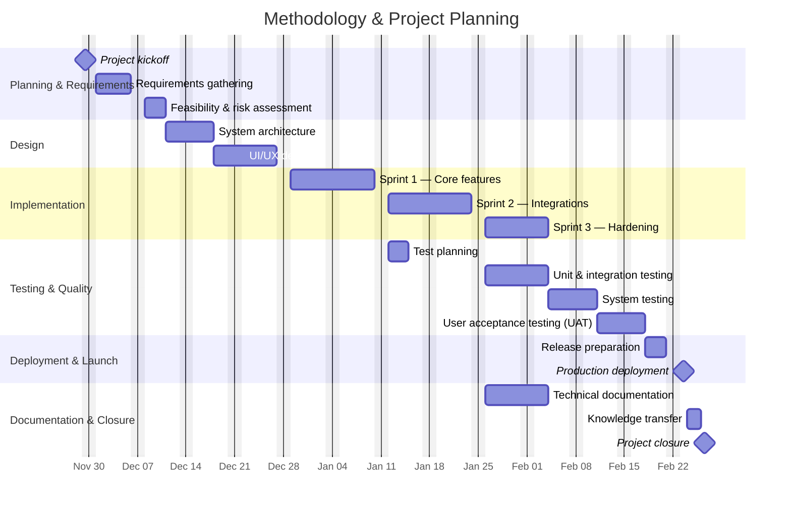

# Section 4 — Methodology & Project Planning

Notes:
- Update the start date on the kickoff task to your actual project start.
- You can use durations like 3d (days) or 2w (weeks).
- Use `after <task_id>` to express dependencies.
- Remove `excludes weekends` if you want to include weekends.

